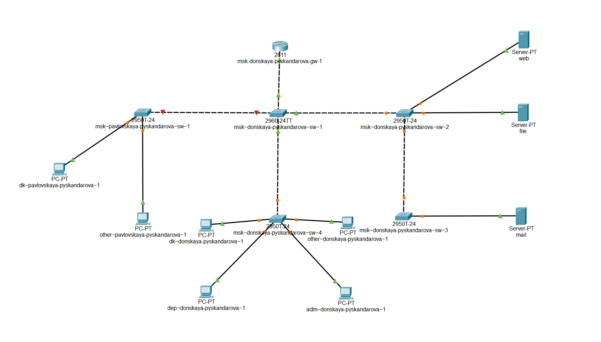
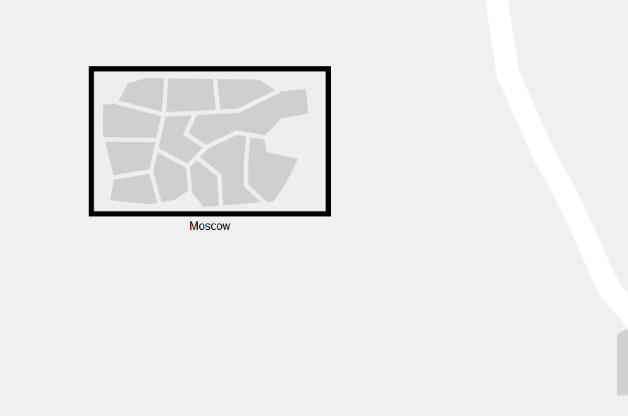
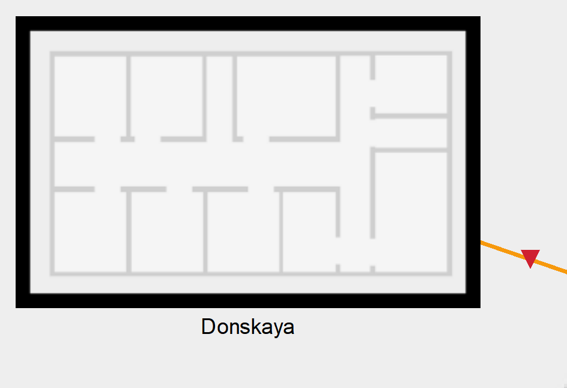
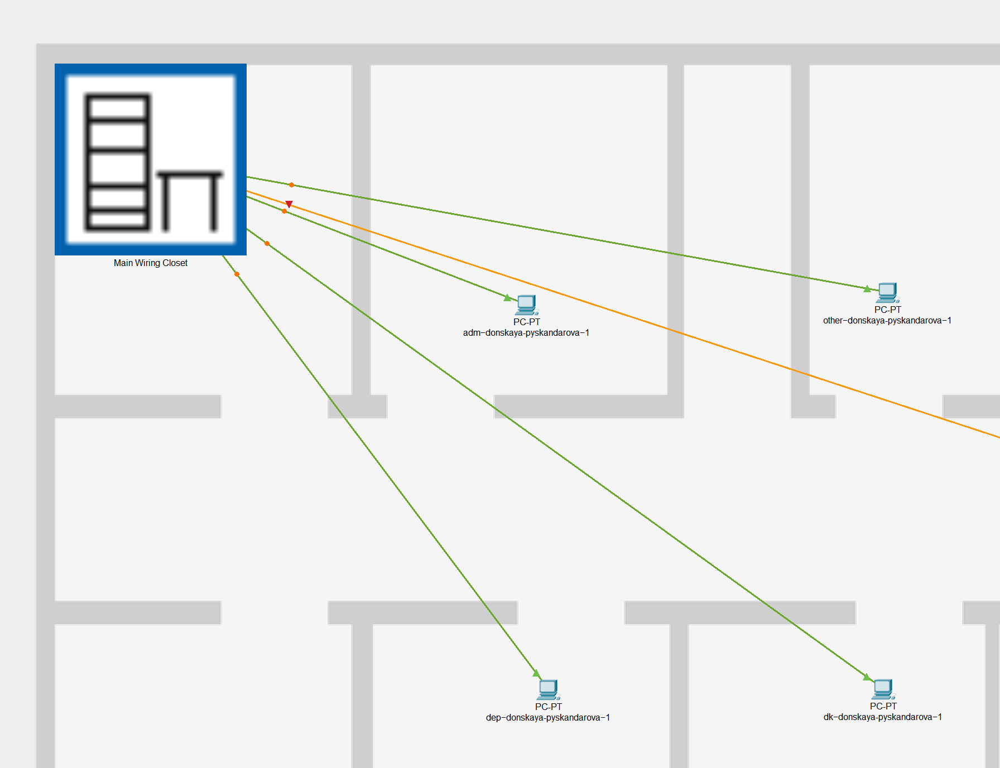
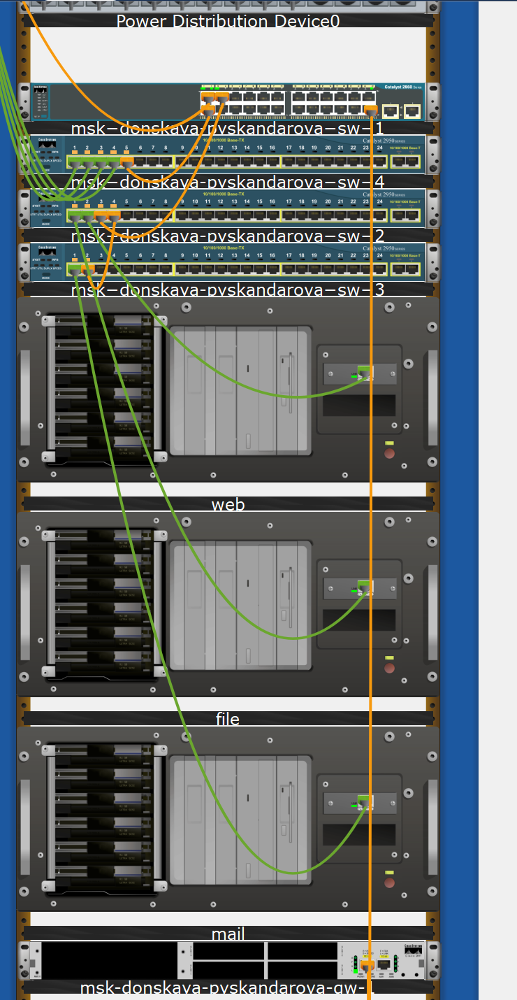
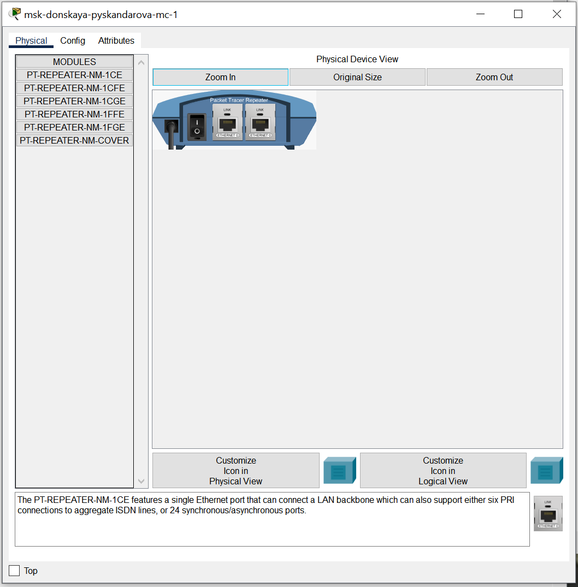
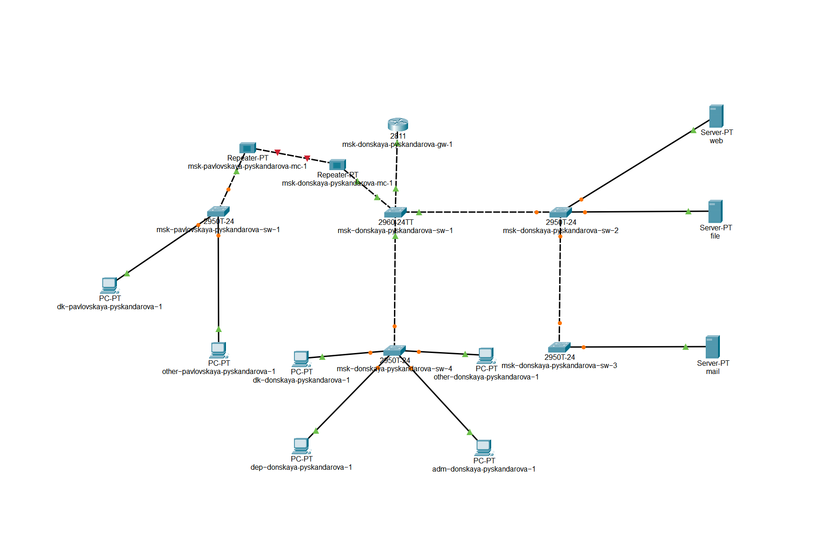
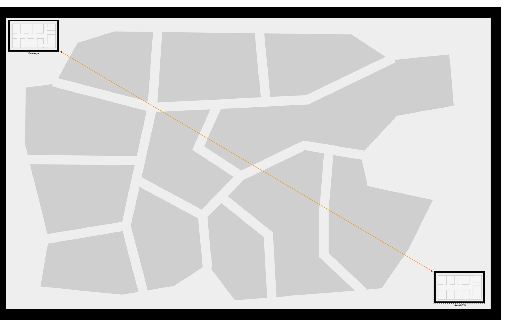

---
## Front matter
lang: ru-RU
title: Администрирование локальных сетей
subtitle: Лаборатторная №7
author:
  - Скандарова П. Ю.
institute:
  - Российский университет дружбы народов, Москва, Россия
date: 29 марта 2025

## i18n babel
babel-lang: russian
babel-otherlangs: english

## Formatting pdf
toc: false
toc-title: Содержание
slide_level: 2
aspectratio: 169
section-titles: true
theme: metropolis
header-includes:
 - \metroset{progressbar=frametitle,sectionpage=progressbar,numbering=fraction}
---

# Информация

## Докладчик

:::::::::::::: {.columns align=center}
::: {.column width="70%"}

  * Скандарова Полина Юрьевна
  * Российский университет дружбы народов
  * [1132221815@pfur.ru](mailto:1132221815@pfur.ru)
  * <https://pyskandarova.github.io/ru/>

# Вводная часть

## Цель работы

- Получить навыки работы с физической рабочей областью Packet Tracer, а также учесть физические параметры сети.

# Последовательность выполнения работы

## Cхема сети без учёта физических параметров сети в логической рабочей области Packet Tracer

:::
::: {.column width="70%"}

:::
::::::::::::::

## Физическая рабочая область Packet Tracer

:::
::: {.column width="70%"}

:::
::::::::::::::

## Изображение здания в физической рабочей области Packet Tracer (сеть территории «Донская»)

:::
::: {.column width="70%"}

:::
::::::::::::::

## Пример размещения в физической рабочей области Packet Tracer серверной с подключением оконечных устройств (сеть территории «Донская»)

:::
::: {.column width="70%"}

:::
::::::::::::::

## Отображение серверных стоек в Packet Tracer

:::
::: {.column width="70%"}

:::
::::::::::::::

## Повторитель с портами PT-REPEATER-NM-1FFE и PT-REPEATER-NM-1CFE для подключения оптоволокна и витой пары по технологии Fast Ethernet

:::
::: {.column width="70%"}

:::
::::::::::::::

## Схема сети с учётом физических параметров сети в логической рабочей области Packet Tracer

:::
::: {.column width="70%"}

:::
::::::::::::::

## Отображение соединения двух территорий в физической рабочей области Packet Tracer

:::
::: {.column width="70%"}

:::
::::::::::::::

# Вывод

## Вывод

- Получены навыки работы с физической рабочей областью Packet Tracer, а также учтены физические параметры сети.
