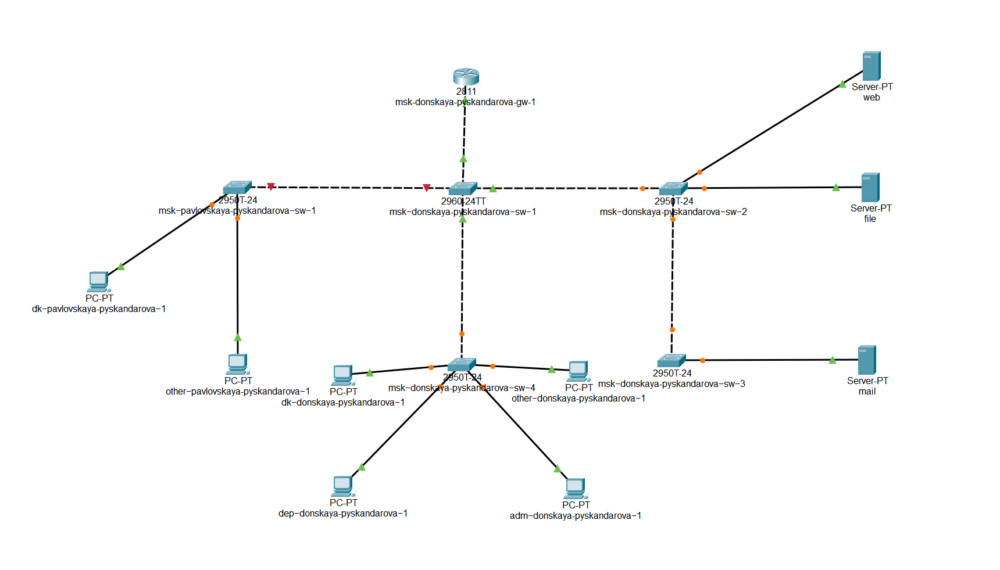
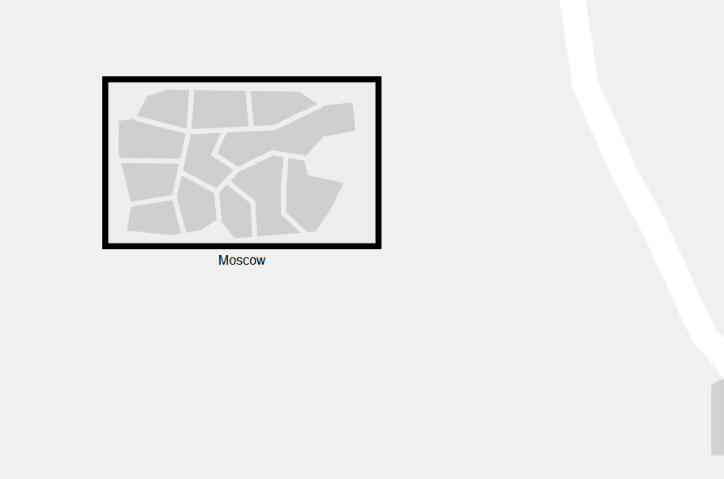
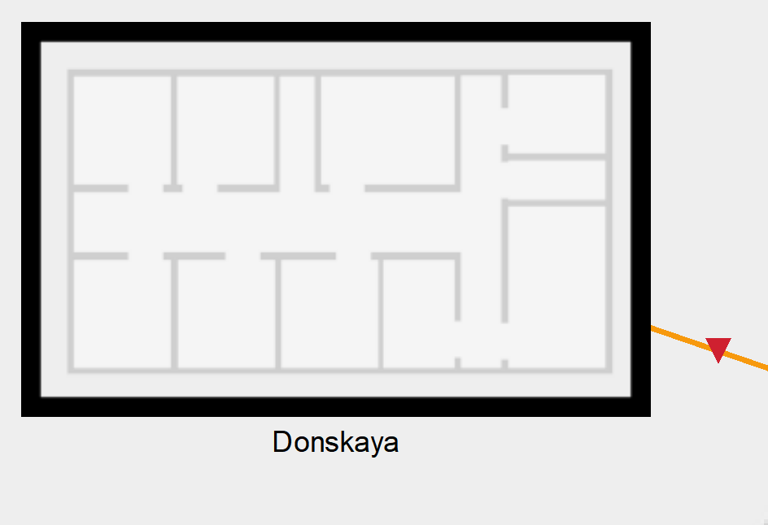
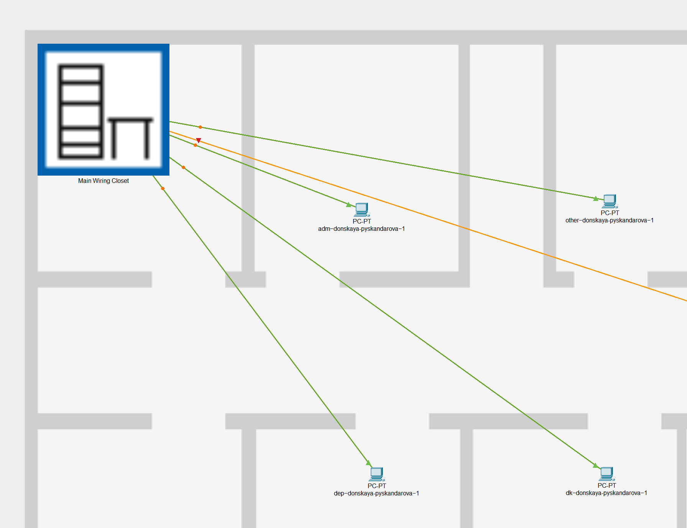
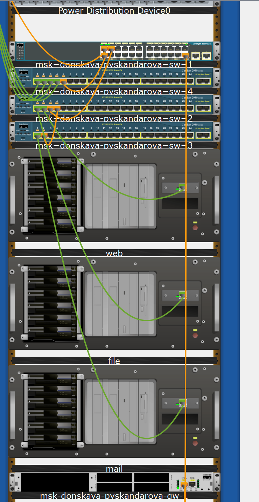
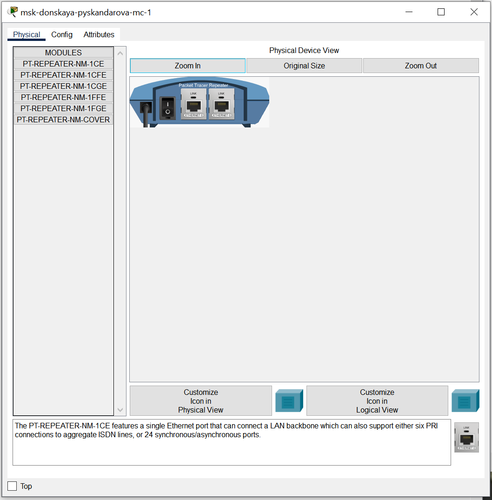
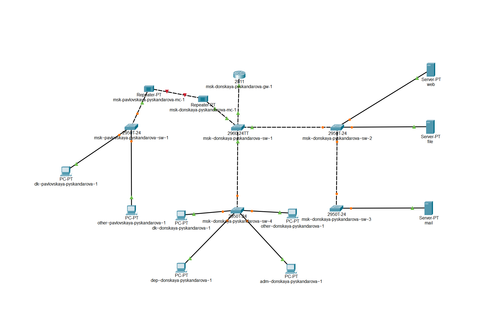
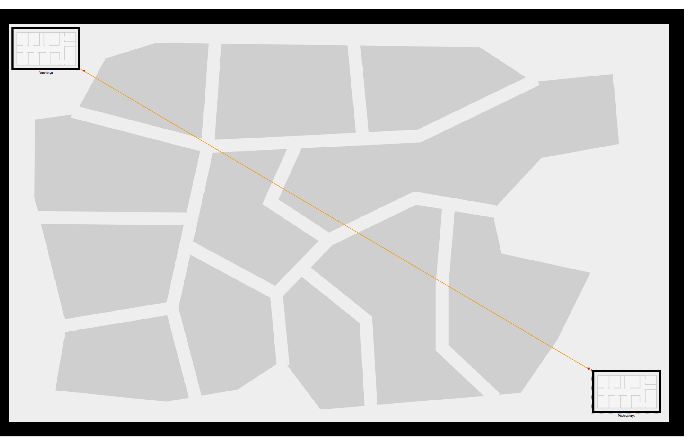

---
## Front matter
title: "Лабораторная работа No 7"
subtitle: "Администрирование локальных сетей"
author: "Скандарова Полина Юрьевна"

## Generic otions
lang: ru-RU
toc-title: "Содержание"

## Bibliography
bibliography: bib/cite.bib
csl: pandoc/csl/gost-r-7-0-5-2008-numeric.csl

## Pdf output format
toc: true # Table of contents
toc-depth: 2
lof: true # List of figures
lot: true # List of tables
fontsize: 12pt
linestretch: 1.5
papersize: a4
documentclass: scrreprt
## I18n polyglossia
polyglossia-lang:
  name: russian
  options:
	- spelling=modern
	- babelshorthands=true
polyglossia-otherlangs:
  name: english
## I18n babel
babel-lang: russian
babel-otherlangs: english
## Fonts
mainfont: IBM Plex Serif
romanfont: IBM Plex Serif
sansfont: IBM Plex Sans
monofont: IBM Plex Mono
mathfont: STIX Two Math
mainfontoptions: Ligatures=Common,Ligatures=TeX,Scale=0.94
romanfontoptions: Ligatures=Common,Ligatures=TeX,Scale=0.94
sansfontoptions: Ligatures=Common,Ligatures=TeX,Scale=MatchLowercase,Scale=0.94
monofontoptions: Scale=MatchLowercase,Scale=0.94,FakeStretch=0.9
mathfontoptions:
## Biblatex
biblatex: true
biblio-style: "gost-numeric"
biblatexoptions:
  - parentracker=true
  - backend=biber
  - hyperref=auto
  - language=auto
  - autolang=other*
  - citestyle=gost-numeric
## Pandoc-crossref LaTeX customization
figureTitle: "Рис."
tableTitle: "Таблица"
listingTitle: "Листинг"
lofTitle: "Список иллюстраций"
lotTitle: "Список таблиц"
lolTitle: "Листинги"
## Misc options
indent: true
header-includes:
  - \usepackage{indentfirst}
  - \usepackage{float} # keep figures where there are in the text
  - \floatplacement{figure}{H} # keep figures where there are in the text
---

# Цель работы

Получить навыки работы с физической рабочей областью Packet Tracer, а также учесть физические параметры сети.

# Выполнение лабораторной работы

Открываю проект предыдущей лабораторной работы (рис. [-@fig:001]).

{#fig:001 width=70%}

Перехожу в физическую рабочую область Packet Tracer. Присваиваю название городу — Moscow (рис. [-@fig:002]). Щёлкнув на изображении города, вижу изображение здания (рис. [-@fig:003]). Присваиваю ему название Donskaya. Добавляю здание для территории Pavlovskaya. Щёлкнув на изображении здания Donskaya, перемещаю изображение, обозначающее серверное помещение, в него (рис. [-@fig:004]).

{#fig:002 width=70%}

{#fig:003 width=70%}

{#fig:004 width=70%}

Щёлкнув на изображении серверной, вижу отображение серверных стоек (рис. [-@fig:005]).

{#fig:005 width=70%}

Перемещаю коммутатор msk-pavlovskaya-sw-1 и два оконечных устройства dk-pavlovskaya-1 и other-pavlovskaya-1 на территорию Pavlovskaya, используя меню Move физической рабочей области Packet Tracer. Вернувшись в логическую рабочую область Packet Tracer, пингую с коммутатора msk-donskaya-sw-1 коммутатор msk-pavlovskaya-sw-1. Убеждаюсь в работоспособности соединения. В меню Options , Preferences во вкладке Interface активирую разрешение на учёт физических характеристик среды передачи (Enable Cable Length Effects). В физической рабочей области Packet Tracer размещаю две территории на расстоянии более 100 м друг от друга (рекомендуемое расстояние — около 1000 м или более). Вернувшись в логическую рабочую область Packet Tracer, пингую с коммутатора msk-donskaya-sw-1 коммутатор msk-pavlovskaya-sw-1. Убеждаюсь в неработоспособности соединения. Удаляю соединение между msk-donskaya-sw-1 и msk-pavlovskaya-sw-1. Добавляю в логическую рабочую область два повторителя (Repeater-PT). Присваиваю им соответствующие названия msk-donskaya-mc-1 и msk-pavlovskaya-mc-1. Заменяю имеющиеся модули на PT-REPEATER-NM-1FFE и PT-REPEATER-NM-1CFE для подключения оптоволокна и витой пары по технологии Fast Ethernet (рис. [-@fig:006]).

{#fig:006 width=70%}

Перемещаю msk-pavlovskaya-mc-1 на территорию Pavlovskaya (в физической рабочей области Packet Tracer). Подключаю коммутатор msk-donskayasw-1 к msk-donskaya-mc-1 по витой паре, msk-donskaya-mc-1 и msk-pavlovskaya-mc-1 — по оптоволокну, msk-pavlovskaya-sw-1 к msk-pavlovskaya-mc-1 — по витой паре (рис. [-@fig:007], рис. [-@fig:008]).

{#fig:007 width=70%}

{#fig:008 width=70%}

Убеждаюсь в работоспособности соединения между msk-donskaya-sw-1 и msk-pavlovskaya-sw-1.

# Выводы

Получены навыки работы с физической рабочей областью Packet Tracer, а также учтены физические параметры сети.

