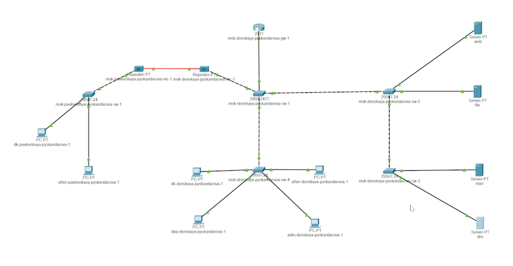
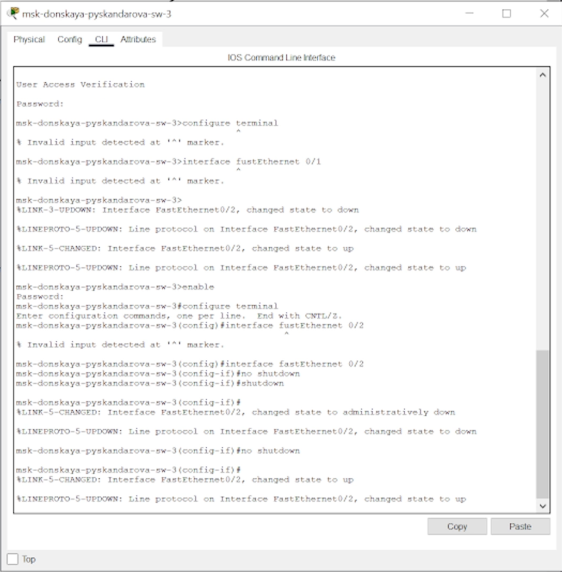
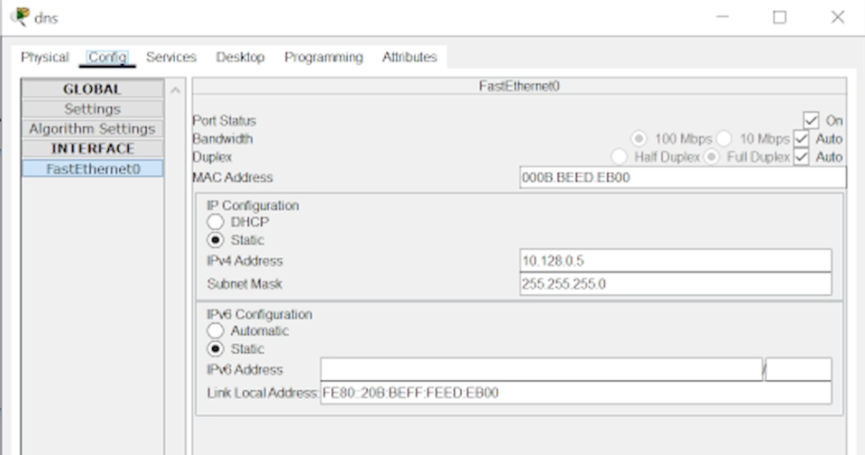
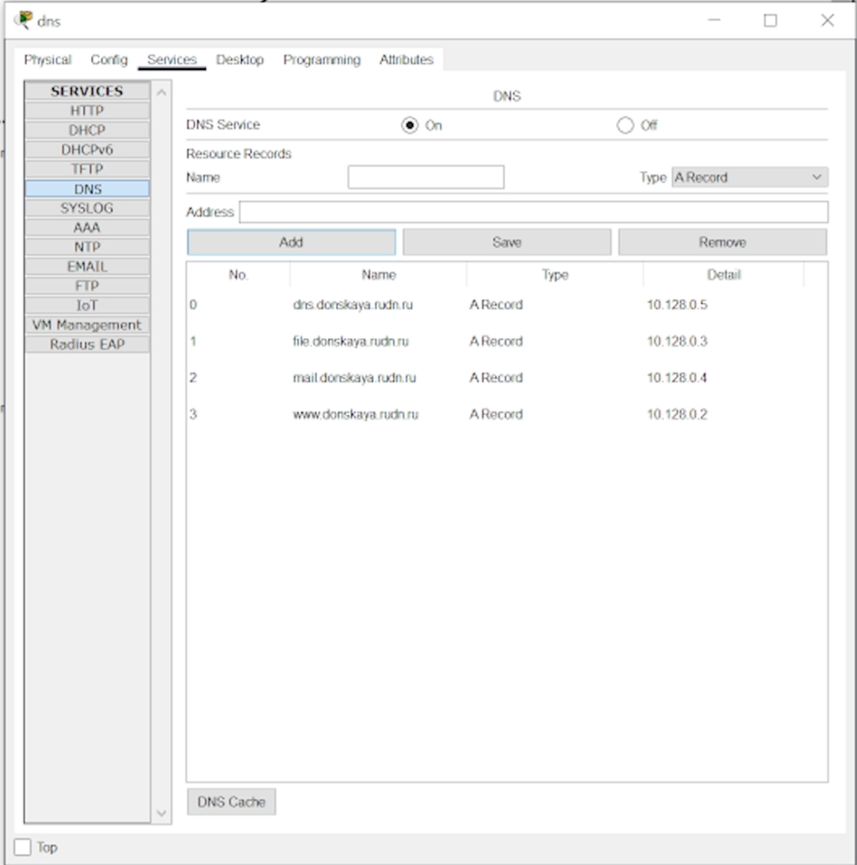
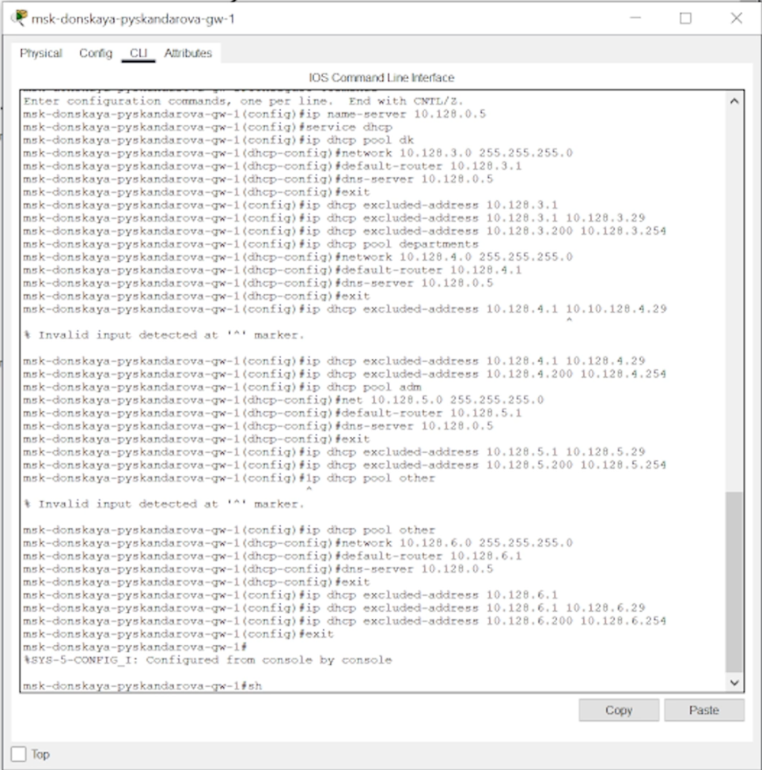

---
## Front matter
lang: ru-RU
title: Администрирование локальных сетей
subtitle: Лабораторная работа 8
author:
  - Скандарова П.Ю.
institute:
  - Российский университет дружбы народов, Москва, Россия
date: 05 апреля 2025

## i18n babel
babel-lang: russian
babel-otherlangs: english

## Formatting pdf
toc: false
toc-title: Содержание
slide_level: 2
aspectratio: 169
section-titles: true
theme: metropolis
header-includes:
 - \metroset{progressbar=frametitle,sectionpage=progressbar,numbering=fraction}
---

# Информация

## Докладчик

  * Скандарова Полина Юрьевна
  * Российский университет дружбы народов
  * [1132221815@pfur.ru](mailto:1132221815@pfur.ru)
  * <https://pyskandarova.github.io/ru/>

# Вводная часть

## Цель

Приобретение практических навыков по настройке динамического распределения IP-адресов посредством протокола DHCP (Dynamic Host Configuration Protocol) [5] в локальной сети.

# Выполнение лабораторной работы

## 1

## 2

## 3

## 4

## 5

# Вывод

## Выводы

Приобретены практические навыки по настройке динамического распределения IP-адресов посредством протокола DHCP (Dynamic Host Configuration Protocol) [5] в локальной сети.

