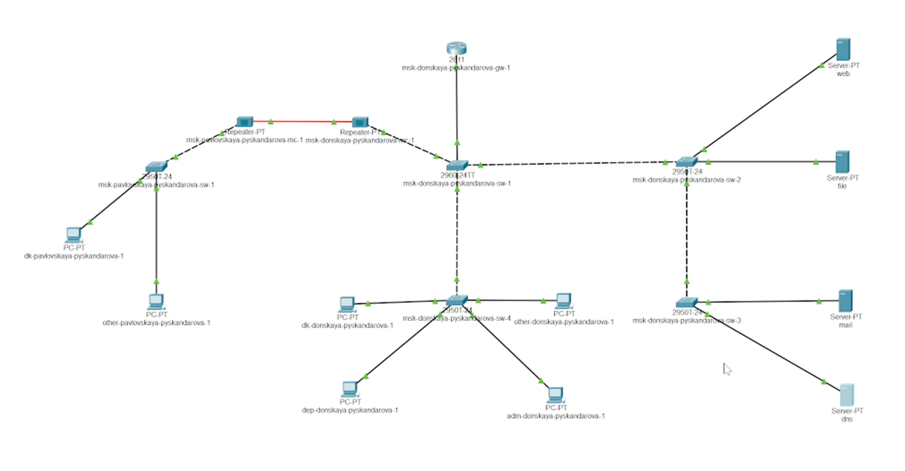
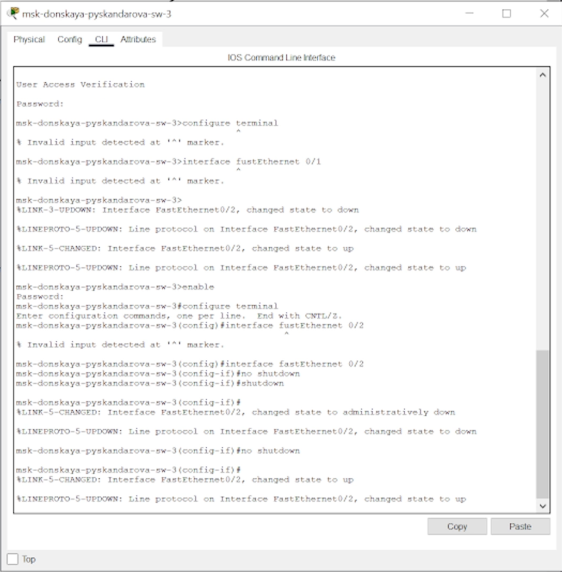
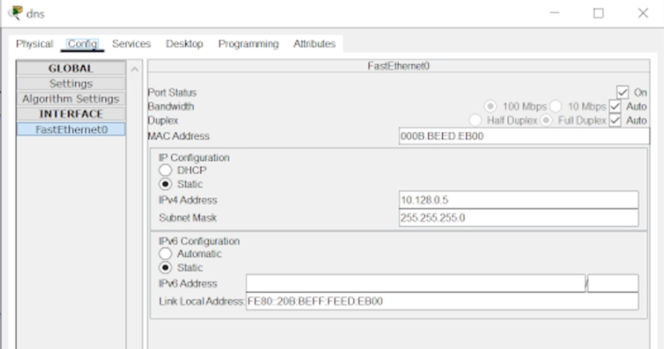
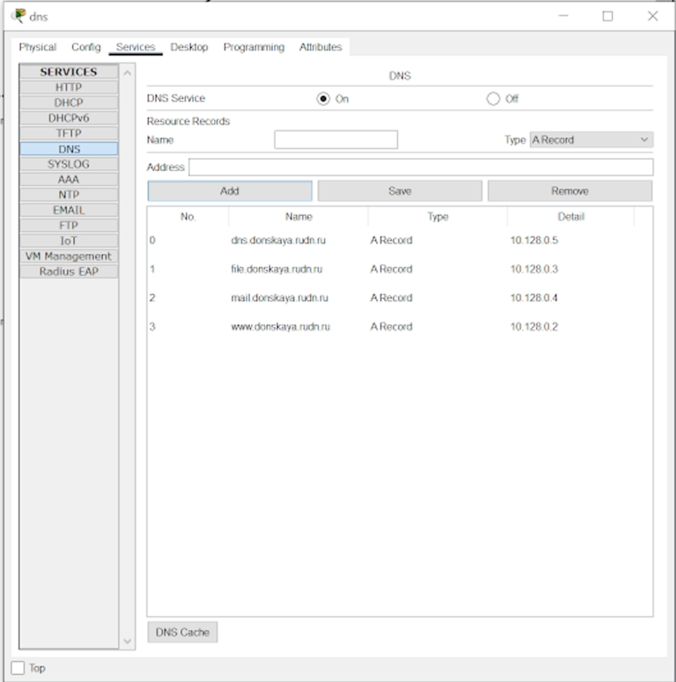
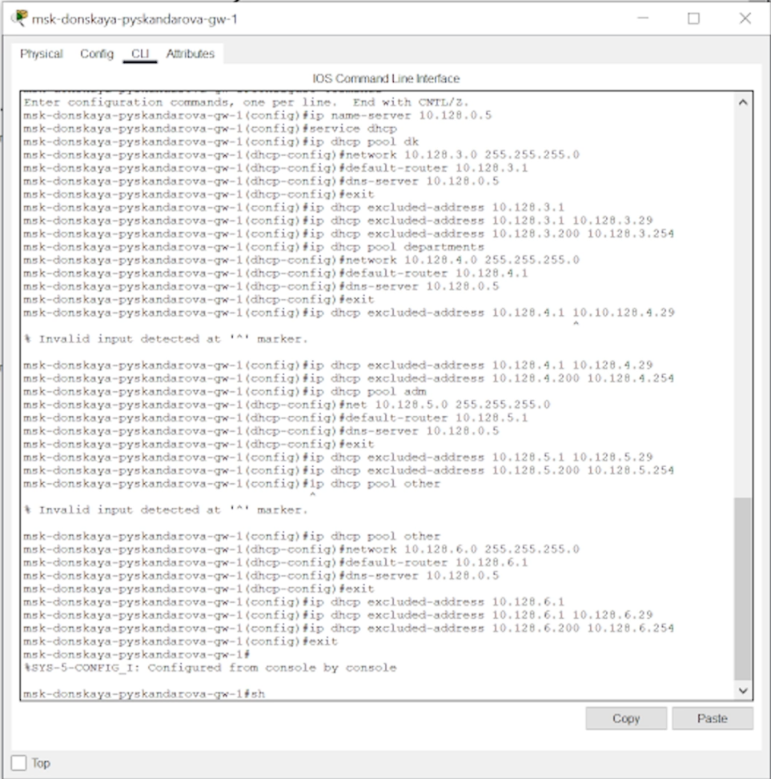

---
## Front matter
title: "Администрирование локальных сетей"
subtitle: "Лабораторная работа 8"
author: "Скандарова Полина Юрьевна"

## Generic otions
lang: ru-RU
toc-title: "Содержание"

## Bibliography
bibliography: bib/cite.bib
csl: pandoc/csl/gost-r-7-0-5-2008-numeric.csl

## Pdf output format
toc: true # Table of contents
toc-depth: 2
lof: true # List of figures
lot: true # List of tables
fontsize: 12pt
linestretch: 1.5
papersize: a4
documentclass: scrreprt
## I18n polyglossia
polyglossia-lang:
  name: russian
  options:
	- spelling=modern
	- babelshorthands=true
polyglossia-otherlangs:
  name: english
## I18n babel
babel-lang: russian
babel-otherlangs: english
## Fonts
mainfont: IBM Plex Serif
romanfont: IBM Plex Serif
sansfont: IBM Plex Sans
monofont: IBM Plex Mono
mathfont: STIX Two Math
mainfontoptions: Ligatures=Common,Ligatures=TeX,Scale=0.94
romanfontoptions: Ligatures=Common,Ligatures=TeX,Scale=0.94
sansfontoptions: Ligatures=Common,Ligatures=TeX,Scale=MatchLowercase,Scale=0.94
monofontoptions: Scale=MatchLowercase,Scale=0.94,FakeStretch=0.9
mathfontoptions:
## Biblatex
biblatex: true
biblio-style: "gost-numeric"
biblatexoptions:
  - parentracker=true
  - backend=biber
  - hyperref=auto
  - language=auto
  - autolang=other*
  - citestyle=gost-numeric
## Pandoc-crossref LaTeX customization
figureTitle: "Рис."
tableTitle: "Таблица"
listingTitle: "Листинг"
lofTitle: "Список иллюстраций"
lotTitle: "Список таблиц"
lolTitle: "Листинги"
## Misc options
indent: true
header-includes:
  - \usepackage{indentfirst}
  - \usepackage{float} # keep figures where there are in the text
  - \floatplacement{figure}{H} # keep figures where there are in the text
---

# Цель работы

Приобретение практических навыков по настройке динамического распределения IP-адресов посредством протокола DHCP (Dynamic Host Configuration Protocol) [5] в локальной сети.

# Выполнение лабораторной работы

В логическую рабочую область проекта добавляю сервер dns и подключаю его к коммутатору msk-donskaya-sw-3 через порт Fa0/2 (рис. [-@fig:001]), не забыв активировать порт при помощи соответствующих команд на коммутаторе (рис. [-@fig:002]). В конфигурации сервера указываю в качестве адреса шлюза 10.128.0.1, а в качестве адреса самого сервера — 10.128.0.5 с соответствующей маской 255.255.255.0. (рис. [-@fig:003]).

{#fig:001 width=70%}

{#fig:002 width=70%}

{#fig:003 width=70%}

Настраиваю сервис DNS (рис. [-@fig:004]):
– в конфигурации сервера выбираю службу DNS, активирую её (выбрав флаг On);
– в поле Type в качестве типа записи DNS выбираю записи типа A (A Record);
– в поле Name указываю доменное имя, по которому можно обратиться, например, к web-серверу — www.donskaya.rudn.ru, затем указываю его IP-адрес в соответствующем поле 10.128.0.2;
– нажав на кнопку Add, добавляю DNS-запись на сервер;
– аналогичным образом добавляю DNS-записи для серверов mail, file, dns согласно распределению адресов из табл. 3.2;
– сохраняю конфигурацию сервера

{#fig:004 width=70%}

Настраиваю DHCP-сервис на маршрутизаторе, используя приведённые ниже команды для каждой выделенной сети (рис. [-@fig:004]): указываю IP-адрес DNS-сервера; затем перехожу к настройке DHCP; задаю название конфигурируемому
диапазону адресов (пулу адресов), указываю адрес сети, а также адреса шлюза и DNS-сервера; задаю пулы адресов, исключаемых из динамического распределения (см. табл. 3.2).
– Настройка DHCP:

msk −donskaya −gw −1> enable
msk −donskaya −gw −1# configure terminal
msk −donskaya −gw −1( config )#ip name − server 10.128.0.5
msk −donskaya −gw −1( config )# service dhcp
msk −donskaya −gw −1( config )#ip dhcp pool dk
msk −donskaya −gw −1( dhcp − config )# network 10.128.3.0 255.255.255.0
msk −donskaya −gw −1( dhcp − config )#default − router 10.128.3.1
msk −donskaya −gw −1( dhcp − config )#dns − server 10.128.0.5
msk −donskaya −gw −1( dhcp − config )#exit
msk −donskaya −gw −1( config )#ip dhcp excluded − address 10.128.3.1 10.128.3.29
msk −donskaya −gw −1( config )#ip dhcp excluded − address 10.128.3.200 10.128.3.254
msk −donskaya −gw −1( config )#ip dhcp pool departments
msk −donskaya −gw −1( dhcp − config )# network 10.128.4.0 255.255.255.0
msk −donskaya −gw −1( dhcp − config )#default − router 10.128.4.1
msk −donskaya −gw −1( dhcp − config )#dns − server 10.128.0.5
msk −donskaya −gw −1( dhcp − config )#exit
msk −donskaya −gw −1( config )#ip dhcp excluded − address 10.128.4.1 10.128.4.29
msk −donskaya −gw −1( config )#ip dhcp excluded − address 10.128.4.200 10.128.4.254
msk −donskaya −gw −1( config )#ip dhcp pool adm
msk −donskaya −gw −1( dhcp − config )# network 10.128.5.0 255.255.255.0
msk −donskaya −gw −1( dhcp − config )#default − router 10.128.5.1
msk −donskaya −gw −1( dhcp − config )#dns − server 10.128.0.5
msk −donskaya −gw −1( dhcp − config )#exit
msk −donskaya −gw −1( config )#ip dhcp excluded − address 10.128.5.1 10.128.5.29
msk −donskaya −gw −1( config )#ip dhcp excluded − address 10.128.5.200 10.128.5.254
msk −donskaya −gw −1( config )#ip dhcp pool other
msk −donskaya −gw −1( dhcp − config )# network 10.128.6.0 255.255.255.0
msk −donskaya −gw −1( dhcp − config )#default − router 10.128.6.1
msk −donskaya −gw −1( dhcp − config )#dns − server 10.128.0.5
msk −donskaya −gw −1( dhcp − config )#exit
msk −donskaya −gw −1( config )#ip dhcp excluded − address 10.128.6.1 10.128.6.29
msk −donskaya −gw −1( config )#ip dhcp excluded − address 10.128.6.200 10.128.6.254

– Информация о пулах DHCP:

msk −donskaya −gw −1# sh ip dhcp pool

– Информация об привязках выданных адресов:

msk −donskaya −gw −1# sh ip dhcp binding

{#fig:005 width=70%}

На оконечных устройствах заменяю в настройках статическое распределение адресов на динамическое. Проверяю, какие адреса выделяются оконечным устройствам, а также доступность устройств из разных подсетей. В режиме симуляции изучаю, каким образом происходит запрос адреса по протоколу DHCP (какие сообщения и какие отклики передаются по сети).

# Выводы

Приобретены практические навыки по настройке динамического распределения IP-адресов посредством протокола DHCP (Dynamic Host Configuration Protocol) [5] в локальной сети.

# Ответы на контрольные вопросы

1 За что отвечает протокол DHCP?
• За автоматическое получение IP и других параметров.
2 Какие типы DHCP-сообщений передаются по сети?
• DHCPDISCOVER (клиент <> сервер) — начальное сообщение.
• DHCPOFFER (сервер <> клиент) — ответ на начальное сообщение с сетевыми настройками.
• DHCPREQUEST (клиент <> сервер) — настройки приняты.
• DHCPACK (сервер <> клиент) — авторизация клиента, настройки приняты.
• DHCPNAK (сервер <> клиент) — авторизация невозможна.
• DHCPDECLINE (клиент <> сервер) — IP уже используется.
• DHCPINFORM (клиент <> сервер) — присвоен статический IP, а нужен динамический.
• DHCPRELEASE (клиент <> сервер) — завершение использования IP.
3 Какие параметры могут быть переданы в сообщениях DHCP?
• По умолчанию запросы от клиента делаются к серверу на порт 67, сервер в свою очередь отвечает клиенту на порт 68, выдавая адрес IP и другую необходимую информацию, такую, как сетевую маску, маршрутизатор и серверы DNS.
4 Что такое DNS?
• Система, ставящая в соответствие доменному имени хоста IP и наоборот.
5 Какие типы записи описания ресурсов есть в DNS и для чего они
используются?
• RR-записи описывают все узлы сети в зоне и помечают делегирование поддоменов.
• SOA-запись — указывает на авторитативность для зоны.
• NS-запись — перечисляет DNS-серверы зоны.
• А — задаёт отображение имени узла в IP.
• PTR — задаёт отображение IP в имя узла.

# Список литературы{.unnumbered}

::: {#refs}
:::
