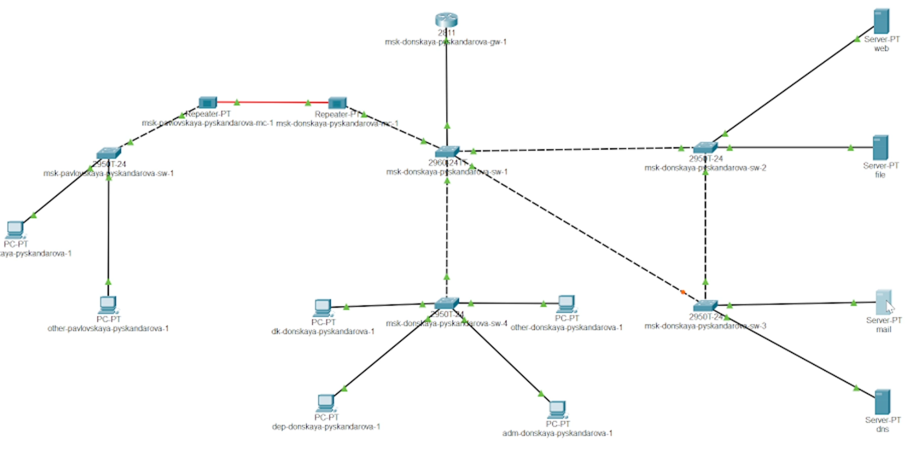
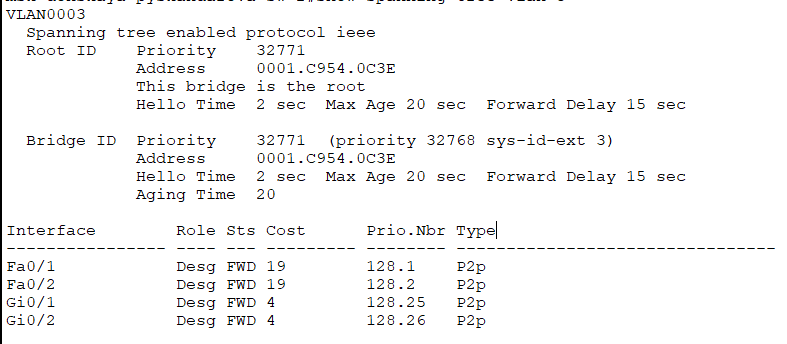
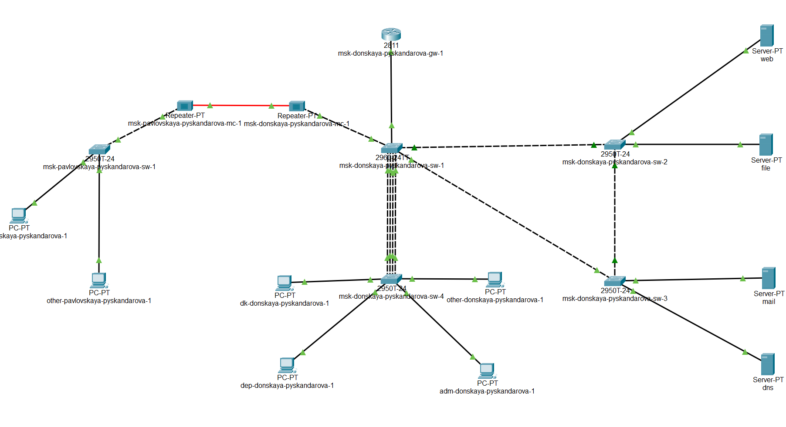

---
## Front matter
lang: ru-RU
title: Администрирование локальных сетей
subtitle: Лабораторная работа 9
author:
  - Скандарова П. Ю.
institute:
  - Российский университет дружбы народов, Москва, Россия
date: 07 апреля 2025

## i18n babel
babel-lang: russian
babel-otherlangs: english

## Formatting pdf
toc: false
toc-title: Содержание
slide_level: 2
aspectratio: 169
section-titles: true
theme: metropolis
header-includes:
 - \metroset{progressbar=frametitle,sectionpage=progressbar,numbering=fraction}
---

# Информация

## Докладчик

  * Скандарова Полина Юрьевна
  * Российский университет дружбы народов
  * [1132221815@pfur.ru](mailto:1132221815@pfur.ru)
  * <https://pyskandarova.github.io/ru/>

# Вводная часть

## Цели и задачи

Изучение возможностей протокола STP и его модификаций по обеспечению отказоустойчивости сети, агрегированию интерфейсов и перераспределению нагрузки между ними.

# Выполнение лабораторной работы

## 1

## 2

## 3

# Результаты

## Вывод

Изучены возможности протокола STP и его модификации по обеспечению отказоустойчивости сети, агрегированию интерфейсов и перераспределению нагрузки между ними.
