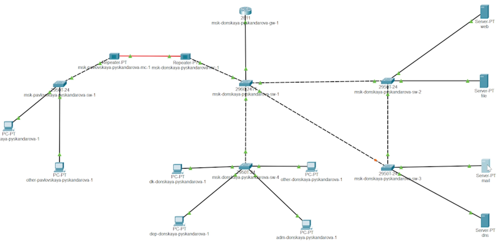
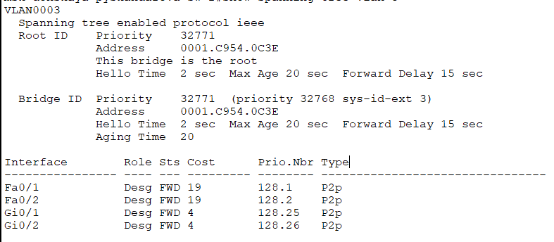
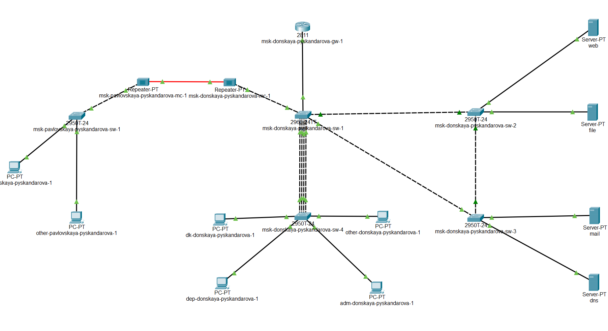

---
## Front matter
title: "Администрирование локальных сетей"
subtitle: "Лабораторная работа 9"
author: "Скандарова Полина Юрьевна"

## Generic otions
lang: ru-RU
toc-title: "Содержание"

## Bibliography
bibliography: bib/cite.bib
csl: pandoc/csl/gost-r-7-0-5-2008-numeric.csl

## Pdf output format
toc: true # Table of contents
toc-depth: 2
lof: true # List of figures
lot: true # List of tables
fontsize: 12pt
linestretch: 1.5
papersize: a4
documentclass: scrreprt
## I18n polyglossia
polyglossia-lang:
  name: russian
  options:
	- spelling=modern
	- babelshorthands=true
polyglossia-otherlangs:
  name: english
## I18n babel
babel-lang: russian
babel-otherlangs: english
## Fonts
mainfont: IBM Plex Serif
romanfont: IBM Plex Serif
sansfont: IBM Plex Sans
monofont: IBM Plex Mono
mathfont: STIX Two Math
mainfontoptions: Ligatures=Common,Ligatures=TeX,Scale=0.94
romanfontoptions: Ligatures=Common,Ligatures=TeX,Scale=0.94
sansfontoptions: Ligatures=Common,Ligatures=TeX,Scale=MatchLowercase,Scale=0.94
monofontoptions: Scale=MatchLowercase,Scale=0.94,FakeStretch=0.9
mathfontoptions:
## Biblatex
biblatex: true
biblio-style: "gost-numeric"
biblatexoptions:
  - parentracker=true
  - backend=biber
  - hyperref=auto
  - language=auto
  - autolang=other*
  - citestyle=gost-numeric
## Pandoc-crossref LaTeX customization
figureTitle: "Рис."
tableTitle: "Таблица"
listingTitle: "Листинг"
lofTitle: "Список иллюстраций"
lotTitle: "Список таблиц"
lolTitle: "Листинги"
## Misc options
indent: true
header-includes:
  - \usepackage{indentfirst}
  - \usepackage{float} # keep figures where there are in the text
  - \floatplacement{figure}{H} # keep figures where there are in the text
---

# Цель работы

Изучение возможностей протокола STP и его модификаций по обеспечению отказоустойчивости сети, агрегированию интерфейсов и перераспределению нагрузки между ними.

# Выполнение лабораторной работы

Формирую резервное соединение между коммутаторами msk-donskaya-sw-1 и msk-donskaya-sw-3 (рис. [-@fig:001]). Для этого:
– заменяю соединение между коммутаторами msk-donskaya-sw-1 (Gig0/2) и msk-donskaya-sw-4 (Gig0/1) на соединение между коммутаторами msk-donskaya-sw-1 (Gig0/2) и msk-donskaya-sw-3 (Gig0/2);
– делаю порт на интерфейсе Gig0/2 коммутатора msk-donskaya-sw-3 транковым:
msk −donskaya −sw −3( config )# int g0 /2
msk −donskaya −sw −3( config −if)# switchport mode trunk
– соединение между коммутаторами msk-donskaya-sw-1 и msk-donskaya- sw-4 делаю через интерфейсы Fa0/23, не забыв активировать их в транковом режиме. 

{#fig:001 width=70%}

С оконечного устройства dk-donskaya-1 пингую серверы mail и web. В режиме симуляции прослеживаю движение пакетов ICMP. Убеждаюсь, что движение пакетов происходит через коммутатор msk-donskaya-sw-2. На коммутаторе msk-donskaya-sw-2 смотрю состояние протокола STP для vlan 3:
msk −donskaya −sw −2# show spanning −tree vlan 3
В результате будет выведена следующая информация, связанная с протоколом STP(рис. [-@fig:002]).

{#fig:002 width=70%}

Здесь, в частности, указывается, что данное устройство является корневым (строка This bridge is the root). В качестве корневого коммутатора STP настраиваю коммутатор msk-donskaya-sw-1:
msk −donskaya −sw −1# configure terminal
msk −donskaya −sw −1( config )#spanning −tree vlan 3 root primary
Используя режим симуляции, убеждаюсь, что пакеты ICMP пойдут от хоста dk-donskaya-1 до mail через коммутаторы msk-donskaya-sw-1 и msk-donskaya-sw-3, а от хоста dk-donskaya-1 до web через коммутаторы
msk-donskaya-sw-1 и msk-donskaya-sw-2. Настраиваю режим Portfast на тех интерфейсах коммутаторов, к которым
подключены серверы:
msk −donskaya −sw −2( config )# interface f0 /1
msk −donskaya −sw −2( config −if)#spanning −tree portfast
msk −donskaya −sw −2( config )# interface f0 /2
msk −donskaya −sw −2( config −if)#spanning −tree portfast
msk −donskaya −sw −3( config )# interface f0 /1
msk −donskaya −sw −3( config −if)#spanning −tree portfast
msk −donskaya −sw −3( config )# interface f0 /2
msk −donskaya −sw −3( config −if)#spanning −tree portfast
Изучаю отказоустойчивость протокола STP и время восстановления соединения при переключении на резервное соединение. Для этого использую команду ping -n 1000 mail.donskaya.rudn.ru на хосте dk-donskaya-1, а разрыв соединения обеспечиваю переводом соответствующего интерфейса коммутатора в состояние shutdown. Переключаю коммутаторы режим работы по протоколу Rapid PVST+:
msk −donskaya −sw −1( config )#spanning −tree mode rapid −pvst
msk −donskaya −sw −2( config )#spanning −tree mode rapid −pvst
msk −donskaya −sw −3( config )#spanning −tree mode rapid −pvst
msk −donskaya −sw −4( config )#spanning −tree mode rapid −pvst
msk − pavlovskaya −sw −1( config )#spanning −tree mode rapid −pvst
Изучаю отказоустойчивость протокола Rapid PVST+ и время восстановления соединения при переключении на резервное соединение. Сформировываю агрегированное соединение интерфейсов Fa0/20 – Fa0/23 между коммутаторами msk-donskaya-sw-1 и msk-donskaya-sw-4 (рис. [-@fig:003]).

{#fig:003 width=70%}

Настраиваю агрегирование каналов (режим EtherChannel):
msk −donskaya −sw −1( config )# interface range f0 /20 − 23
msk −donskaya −sw −1( config −if − range )#channel − group 1 mode on
msk −donskaya −sw −1( config −if − range )#exit
msk −donskaya −sw −1( config )# interface port − channel 1
msk −donskaya −sw −1( config −if)# switchport mode trunk
msk −donskaya −sw −4( config )# int range f0 /20 − 23
msk −donskaya −sw −4( config −if − range )#no switchport access vlan 104
msk −donskaya −sw −4( config −if − range )#exit
msk −donskaya −sw −4( config )# interface range f0 /20 − 23
msk −donskaya −sw −4( config −if − range )#channel − group 1 mode on
msk −donskaya −sw −4( config −if − range )#exit
msk −donskaya −sw −4( config )# interface port − channel 1
msk −donskaya −sw −4( config −if)# switchport mode trunk
Здесь использована следующая терминология Cisco:
– EtherChannel — технология агрегирования каналов;
– port-channel — логический интерфейс, который объединяет физиче- ские интерфейсы;
– channel-group — команда, которая указывает, какому логическому интерфейсу принадлежит физический интерфейс и какой режим используется для агрегирования;
– возможные параметры channel-group:
– active — включить LACP;
– passive — включить LACP, только если придёт сообщение LACP;
– desirable — включить PAgP;
– auto — включить PAgP, только если придёт сообщение PAgP;
– on — включить только EtherChannel.

# Выводы

Изучены возможности протокола STP и его модификации по обеспечению отказоустойчивости сети, агрегированию интерфейсов и перераспределению нагрузки между ними.
