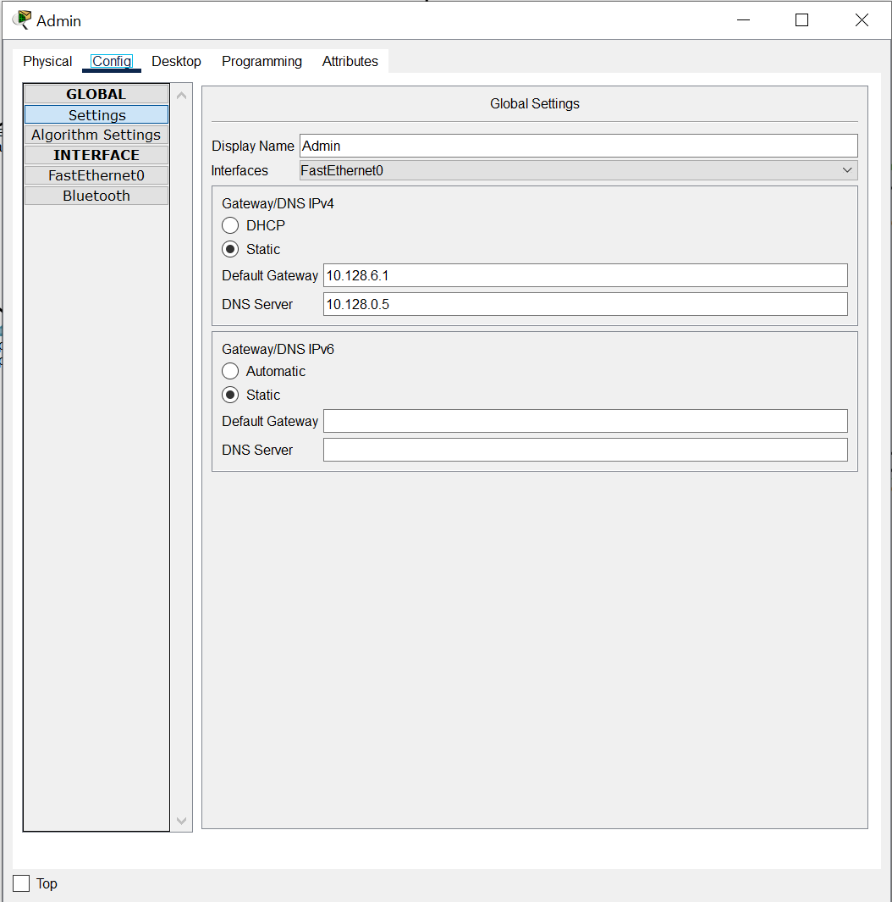
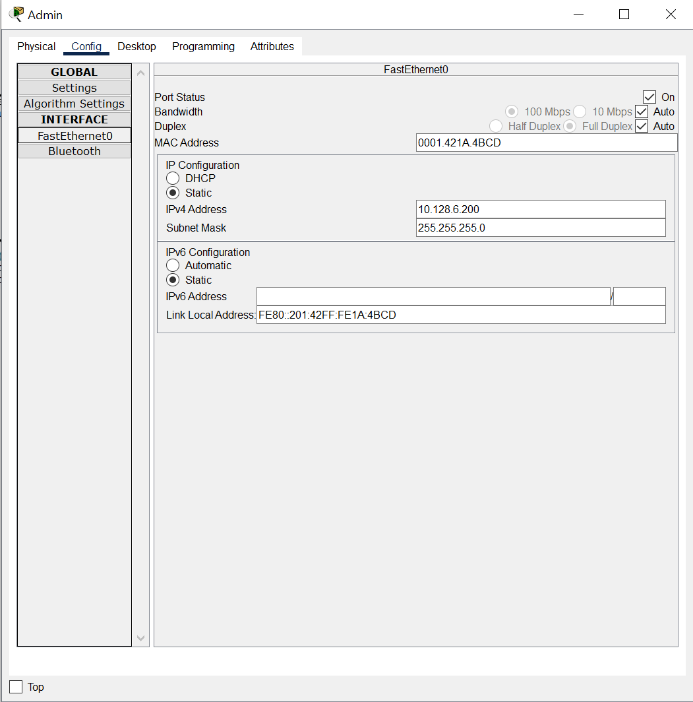
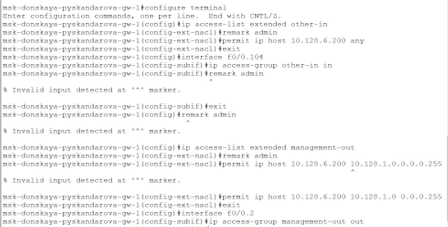
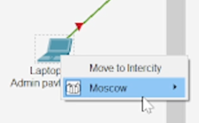
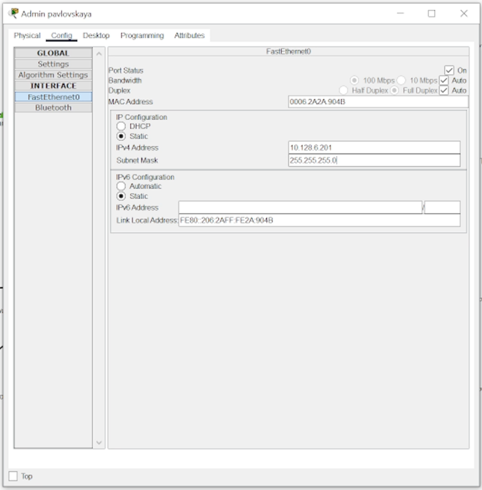
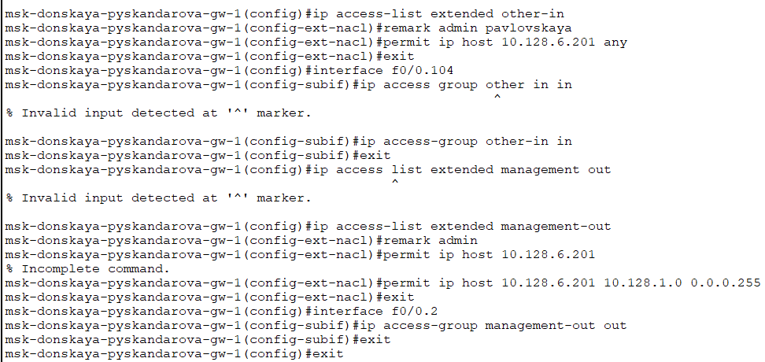
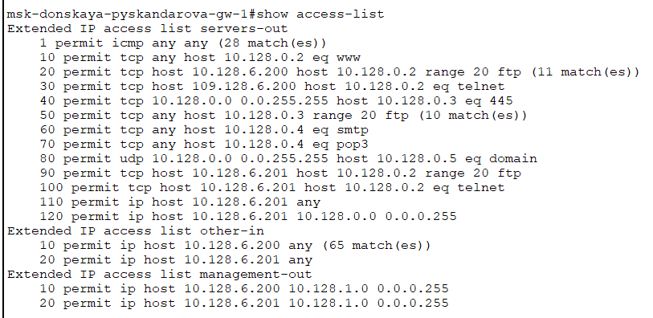

---
## Front matter
lang: ru-RU
title: Администрирование локальных сетей
subtitle: Лабораторная работа №10
author:
  - Скандарова П. Ю.
institute:
  - Российский университет дружбы народов, Москва, Россия
date: 15 апреля 2025

## i18n babel
babel-lang: russian
babel-otherlangs: english

## Formatting pdf
toc: false
toc-title: Содержание
slide_level: 2
aspectratio: 169
section-titles: true
theme: metropolis
header-includes:
 - \metroset{progressbar=frametitle,sectionpage=progressbar,numbering=fraction}
---

# Информация

## Докладчик

  * Скандарова Полина Юрьевна
  * Российский университет дружбы народов
  * [1132221815@pfur.ru](mailto:1132221815@pfur.ru)
  * <https://skandarovapy.github.io/ru/>

# Вводная часть

## Цели и задачи

Освоить настройку прав доступа пользователей к ресурсам сети.

# Выполнение лабораторной работы

## 1

:::::::::::::: {.columns align=center}
::: {.column width="70%"}

:::
::: {.column width="30%"}

- Рабочая область проекта с добавленными ноутбуками администраторов

:::
::::::::::::::

## 2

:::::::::::::: {.columns align=center}
::: {.column width="70%"}

:::
::: {.column width="30%"}

- Добавленные DNS и gateway адреса

:::
::::::::::::::

## 3

:::::::::::::: {.columns align=center}
::: {.column width="70%"}

:::
::: {.column width="30%"}

- Добавленный статический IP-адрес

:::
::::::::::::::

## 4

:::::::::::::: {.columns align=center}
::: {.column width="70%"}

- Создание списка контроля доступа с названием servers-out
- Подключение список прав доступа servers-out к интерфейсу f0/0.3 и применение к исходящему трафику (out)
- Добавление правила, разрешающего устройству администратора с ip-адресом 10.128.6.200 доступ на web-сервер (10.128.0.2) по протоколам FTP и telnet, в список контроля доступа servers-out

:::
::: {.column width="30%"}

:::
::::::::::::::

## 5

:::::::::::::: {.columns align=center}
::: {.column width="70%"}

:::
::: {.column width="30%"}

- Проверка доступа к web-серверу по протоколу FTP с устройства администратора

:::
::::::::::::::

## 6

:::::::::::::: {.columns align=center}
::: {.column width="70%"}

- Всем узлам внутренней сети (10.128.0.0) разрешён доступ по протоколу SMB (работает через порт 445 протокола TCP) к каталогам общего пользования
- Любым узлам разрешён доступ к file-серверу по протоколу FTP
- Всем разрешён доступ к почтовому серверу по протоколам POP3 и SMTP
- Правило разрешения для icmp-запросов добавлено в начало списка контроля доступа

:::
::: {.column width="30%"}

:::
::::::::::::::

## 7

:::::::::::::: {.columns align=center}
::: {.column width="70%"}

:::
::: {.column width="30%"}

- Применение команды msk−donskaya−gw−1# show access−lists

:::
::::::::::::::

## 8

:::::::::::::: {.columns align=center}
::: {.column width="70%"}

- Даётся разрешение устройству с адресом 10.128.6.200 на любые действия (any)
- К интерфейсу f0/0.104 подключается список прав доступа other-in и применяется к входящему трафику (in)
- Устройству администратора с адресом 10.128.6.200 разрешён доступ к сети сетевого оборудования (10.128.1.0)
- К интерфейсу f0/0.2 подключается список прав доступа management-out и применяется к исходящему трафику (out)

:::
::: {.column width="30%"}

:::
::::::::::::::

# Самостоятельная работа

## 9

:::::::::::::: {.columns align=center}
::: {.column width="70%"}

:::
::: {.column width="30%"}

- Проверка доступа к разным серверам с устройства администратора

:::
::::::::::::::

## 10

:::::::::::::: {.columns align=center}
::: {.column width="70%"}

:::
::: {.column width="30%"}

- Проблемы с доступом у ноутбука

:::
::::::::::::::

## 11

:::::::::::::: {.columns align=center}
::: {.column width="70%"}

:::
::: {.column width="30%"}

- Проверка доступа к web-серверу по протоколу FTP с устройства администратора

:::
::::::::::::::

## 12

:::::::::::::: {.columns align=center}
::: {.column width="70%"}

:::
::: {.column width="30%"}

- Исправление проблем с доступом

:::
::::::::::::::

## 13

:::::::::::::: {.columns align=center}
::: {.column width="70%"}

:::
::: {.column width="30%"}

- Добавленный статический IP-адрес

:::
::::::::::::::

## 14

:::::::::::::: {.columns align=center}
::: {.column width="70%"}

:::
::: {.column width="30%"}

- Настройка разрешений для ноутбука администратора на Павловской

:::
::::::::::::::

## 15

:::::::::::::: {.columns align=center}
::: {.column width="70%"}

:::
::: {.column width="30%"}

- Проверка списка разрешений

:::
::::::::::::::

# Результаты

## Вывод

- Освоена настройка прав доступа пользователей к ресурсам сети.
