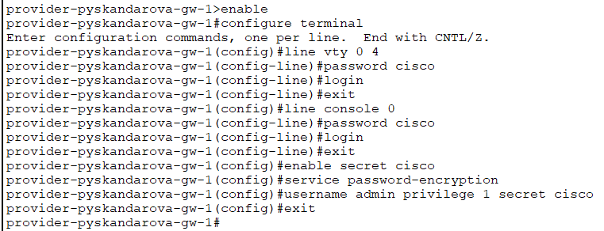
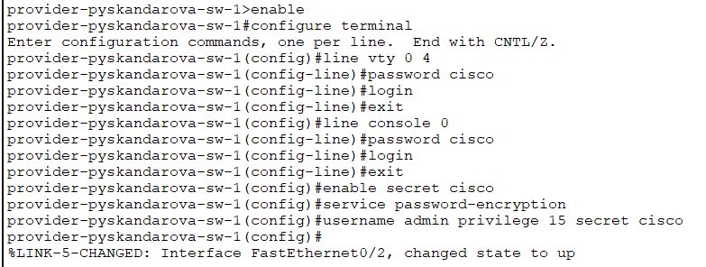
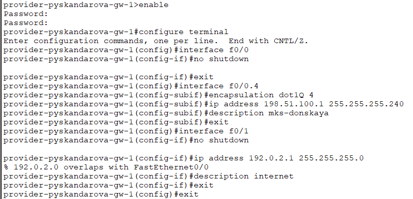
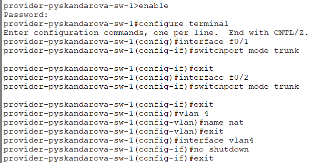
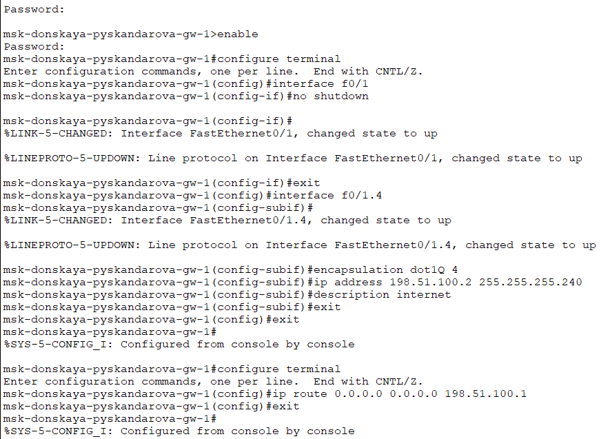
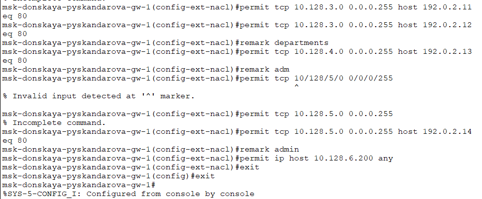
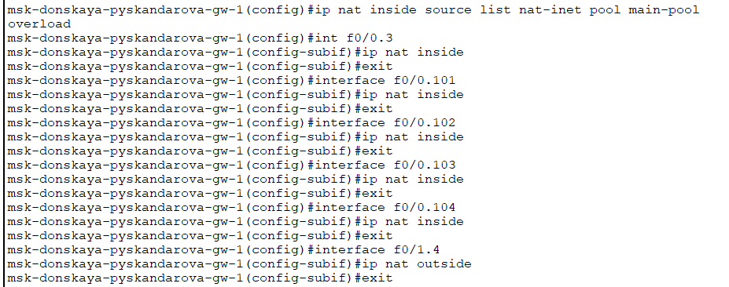
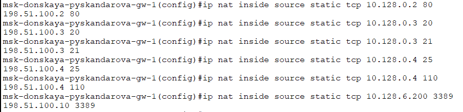

---
## Front matter
lang: ru-RU
title: Лабораторная работа №12
subtitle: Администрирование локальных сетей
author:
  - Скандарова П.Ю.
institute:
  - Российский университет дружбы народов, Москва, Россия
date: 28 апреля 2025

## i18n babel
babel-lang: russian
babel-otherlangs: english

## Formatting pdf
toc: false
toc-title: Содержание
slide_level: 2
aspectratio: 169
section-titles: true
theme: metropolis
header-includes:
 - \metroset{progressbar=frametitle,sectionpage=progressbar,numbering=fraction}
---

# Информация

## Докладчик

:::::::::::::: {.columns align=center}
::: {.column width="70%"}

  * Скандарова Полина Юрьевна
  * Российский университет дружбы народов
  * [pyskandarova@pfur.ru](mailto:pyskandarova@pfur.ru)
  * <https://pyskandarova.github.io/ru/>

:::
::::::::::::::

# Вводная часть

## Цели и задачи

Приобретение практических навыков по настройке доступа локальной сети к внешней сети посредством NAT.

# Создание презентации

## 1

:::::::::::::: {.columns align=center}
::: {.column width="30%"}

  Первоначальная настройка маршрутизатора provider-pyskandarova-gw-1

:::
::: {.column width="70%"}

:::
::::::::::::::

## 2

:::::::::::::: {.columns align=center}
::: {.column width="30%"}

  Первоначальная настройка маршрутизатора provider-pyskandarova-sw-1

:::
::: {.column width="70%"}

:::
::::::::::::::

## 3

:::::::::::::: {.columns align=center}
::: {.column width="30%"}

  Настройка интерфейсов маршрутизатора provider-gw-1

:::
::: {.column width="70%"}

:::
::::::::::::::

## 4

:::::::::::::: {.columns align=center}
::: {.column width="30%"}

  Настройка интерфейсов маршрутизатора provider-sw-1

:::
::: {.column width="70%"}

:::
::::::::::::::

## 5

:::::::::::::: {.columns align=center}
::: {.column width="30%"}

  Настройка интерфейсов маршрутизатора msk-donskaya-gw-1

:::
::: {.column width="70%"}

:::
::::::::::::::

## 6

:::::::::::::: {.columns align=center}
::: {.column width="30%"}

  Настройка пула адресов для NAT, настройка списка доступа для NAT, сеть дисплейных классов, сеть кафедр, сеть администрации, доступ для компьютера администратора.

:::
::: {.column width="70%"}

:::
::::::::::::::

## 7

:::::::::::::: {.columns align=center}
::: {.column width="30%"}

  Настройка NAT

:::
::: {.column width="70%"}

:::
::::::::::::::

## 8

:::::::::::::: {.columns align=center}
::: {.column width="30%"}

  WWW-сервер, файловый сервер, почтовый сервер, доступ по RDP

:::
::: {.column width="70%"}

:::
::::::::::::::

# Результаты

## Выводы

Приобретены практические навыки по настройке доступа локальной сети к внешней сети посредством NAT.
