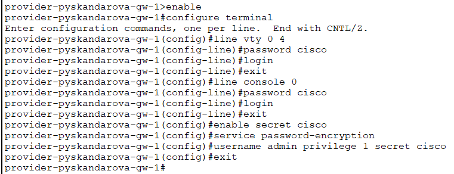
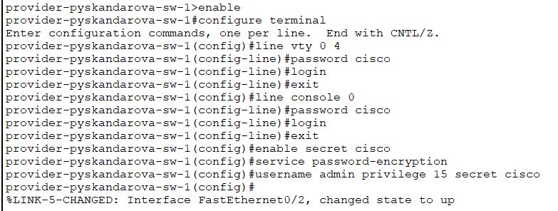
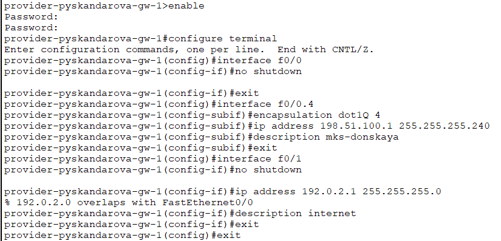
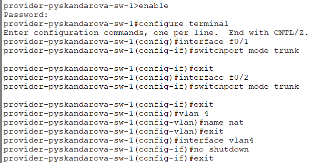
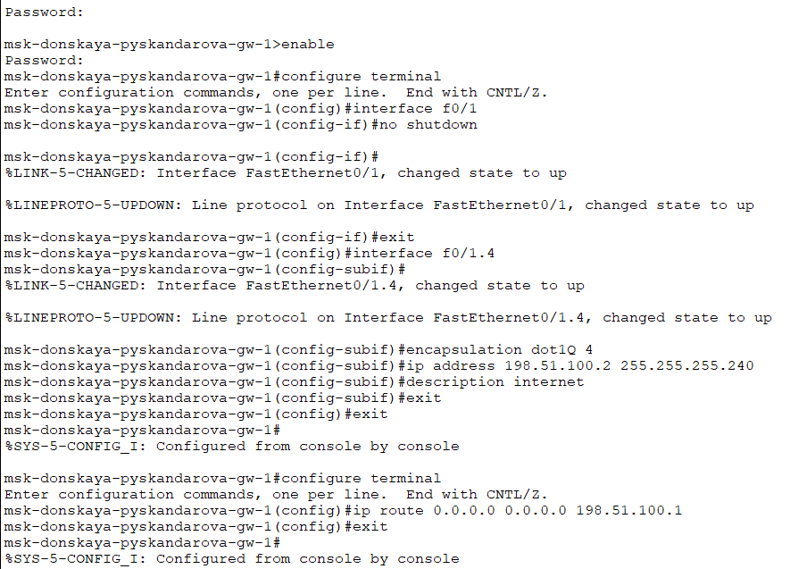
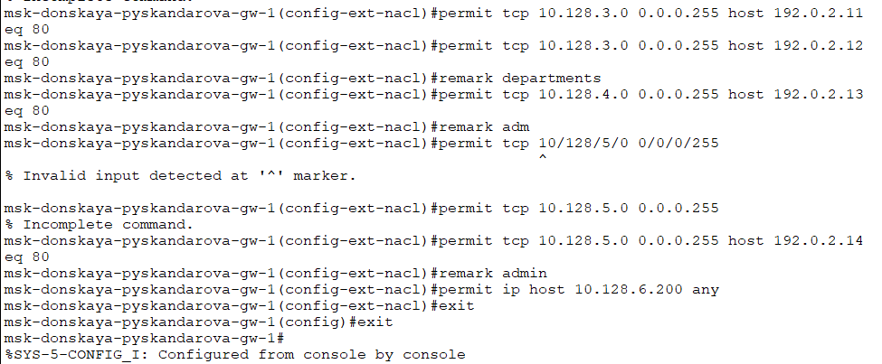
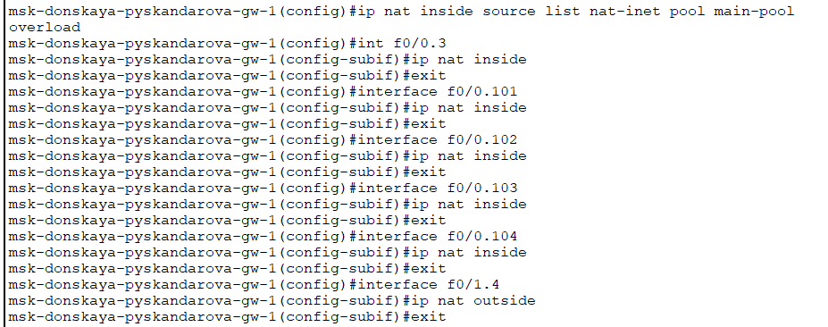
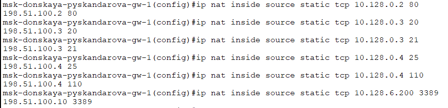

---
## Front matter
title: "Лабораторная работа №12"
subtitle: "Администрирование локальных сетей"
author: "Скандарова Полина Юрьевна"

## Generic otions
lang: ru-RU
toc-title: "Содержание"

## Bibliography
bibliography: bib/cite.bib
csl: pandoc/csl/gost-r-7-0-5-2008-numeric.csl

## Pdf output format
toc: true # Table of contents
toc-depth: 2
lof: true # List of figures
lot: true # List of tables
fontsize: 12pt
linestretch: 1.5
papersize: a4
documentclass: scrreprt
## I18n polyglossia
polyglossia-lang:
  name: russian
  options:
	- spelling=modern
	- babelshorthands=true
polyglossia-otherlangs:
  name: english
## I18n babel
babel-lang: russian
babel-otherlangs: english
## Fonts
mainfont: IBM Plex Serif
romanfont: IBM Plex Serif
sansfont: IBM Plex Sans
monofont: IBM Plex Mono
mathfont: STIX Two Math
mainfontoptions: Ligatures=Common,Ligatures=TeX,Scale=0.94
romanfontoptions: Ligatures=Common,Ligatures=TeX,Scale=0.94
sansfontoptions: Ligatures=Common,Ligatures=TeX,Scale=MatchLowercase,Scale=0.94
monofontoptions: Scale=MatchLowercase,Scale=0.94,FakeStretch=0.9
mathfontoptions:
## Biblatex
biblatex: true
biblio-style: "gost-numeric"
biblatexoptions:
  - parentracker=true
  - backend=biber
  - hyperref=auto
  - language=auto
  - autolang=other*
  - citestyle=gost-numeric
## Pandoc-crossref LaTeX customization
figureTitle: "Рис."
tableTitle: "Таблица"
listingTitle: "Листинг"
lofTitle: "Список иллюстраций"
lotTitle: "Список таблиц"
lolTitle: "Листинги"
## Misc options
indent: true
header-includes:
  - \usepackage{indentfirst}
  - \usepackage{float} # keep figures where there are in the text
  - \floatplacement{figure}{H} # keep figures where there are in the text
---

# Цель работы

Приобретение практических навыков по настройке доступа локальной сети к внешней сети посредством NAT.

# Выполнение лабораторной работы

Первоначальная настройка маршрутизатора provider-gw-1

  provider −gw −1> enable
  provider −gw −1# configure terminal
  provider −gw −1( config )# line vty 0 4
  provider −gw −1( config − line )# password cisco
  provider −gw −1( config − line )# login
  provider −gw −1( config − line )#exit
  provider −gw −1( config )# line console 0
  provider −gw −1( config − line )# password cisco
  provider −gw −1( config − line )# login
  provider −gw −1( config − line )#exit
  provider −gw −1( config )#enable secret cisco
  provider −gw −1( config )# service password − encryption
  provider −gw −1( config )# username admin privilege 1 secret cisco

(рис. [-@fig:001]).

{#fig:001 width=70%}

Первоначальная настройка коммутатора provider-sw-1

  provider −sw −1> enable
  provider −sw −1# configure terminal
  provider −sw −1( config )# line vty 0 4
  provider −sw −1( config − line )# password cisco
  provider −sw −1( config − line )# login
  provider −sw −1( config − line )#exit
  provider −sw −1( config )# line console 0
  provider −sw −1( config − line )# password cisco
  provider −sw −1( config − line )# login
  provider −sw −1( config − line )#exit
  provider −sw −1( config )#enable secret cisco
  provider −sw −1( config )# service password − encryption
  provider −sw −1( config )# username admin privilege 1 secret cisco

(рис. [-@fig:002]).

{#fig:002 width=70%}

Настройка интерфейсов маршрутизатора provider-gw-1

  provider −gw −1> enable
  provider −gw −1# configure terminal
  provider −gw −1( config )# interface f0/0
  provider −gw −1( config −if)#no shutdown
  provider −gw −1( config −if)#exit
  provider −gw −1( config )# interface f0 /0.4
  provider −gw −1( config −subif)# encapsulation dot1Q 4
  provider −gw −1( config −subif)#ip address 198.51.100.1 255.255.255.240
  provider −gw −1( config −subif)# description mks − donskaya
  provider −gw −1( config −subif)#exit
  provider −gw −1( config )# interface f0/1
  provider −gw −1( config −if)#no shutdown
  provider −gw −1( config −if)#ip address 192.0.2.1 255.255.255.0
  provider −gw −1( config −if)# description internet
  provider −gw −1( config −if)#exit
  provider −gw −1( config )#exit

(рис. [-@fig:003]).

{#fig:003 width=70%}

Настройка интерфейсов коммутатора provider-sw-1

  provider −sw −1> enable
  provider −sw −1# configure terminal
  provider −sw −1( config )# interface f0/1
  provider −sw −1( config −if)# switchport mode trunk
  provider −sw −1( config −if)#exit
  provider −sw −1( config )# interface f0/2
  provider −sw −1( config −if)# switchport mode trunk
  provider −sw −1( config −if)#exit
  provider −sw −1( config )#vlan 4
  provider −sw −1( config −vlan)#name nat
  provider −sw −1( config −vlan)#exit
  provider −sw −1( config )# interface vlan4
  provider −sw −1( config −if)#no shutdown
  provider −sw −1( config −if)#exit

(рис. [-@fig:004]).

{#fig:004 width=70%}

Настройка интерфейсов маршрутизатора msk-donskaya-gw-1

  msk −donskaya −gw −1> enable
  msk −donskaya −gw −1# configure terminal
  msk −donskaya −gw −1( config )# interface f0/1
  msk −donskaya −gw −1( config −if)#no shutdown
  msk −donskaya −gw −1( config −if)#exit
  msk −donskaya −gw −1( config )# interface f0 /1.4
  msk −donskaya −gw −1( config −subif)# encapsulation dot1Q 4
  msk −donskaya −gw −1( config −subif)#ip address 198.51.100.2 255.255.255.240
  msk −donskaya −gw −1( config −subif)# description internet
  msk −donskaya −gw −1( config −subif)#exit
  msk −donskaya −gw −1( config )#exit
  msk −donskaya −gw −1> enable
  msk −donskaya −gw −1# configure terminal
  msk −donskaya −gw −1( config )#ip route 0.0.0.0 0.0.0.0 198.51.100.1
  msk −donskaya −gw −1( config )#exit

(рис. [-@fig:005]).

{#fig:005 width=70%}

Настройка пула адресов для NAT, настройка списка доступа для NAT, сеть дисплейных классов, сеть кафедр, сеть администрации, доступ для компьютера администратора.

  msk −donskaya −gw −1> enable
  msk −donskaya −gw −1# configure terminal
  msk −donskaya −gw −1( config )#ip nat pool main − pool 198.51.100.2 198.51.100.14 netmask 255.255.255.240
  msk −donskaya −gw −1( config )#ip access −list extended nat −inet
  msk −donskaya −gw −1( config −ext −nacl)#remark dk
  msk −donskaya −gw −1( config −ext −nacl)#permit tcp 10.128.3.0 0.0.0.255 host 192.0.2.11 eq 80
  msk −donskaya −gw −1( config −ext −nacl)#permit tcp 10.128.3.0 0.0.0.255 host 192.0.2.12 eq 80
  msk −donskaya −gw −1( config −ext −nacl)#remark departments
  msk −donskaya −gw −1( config −ext −nacl)#permit tcp 10.128.4.0 0.0.0.255 host 192.0.2.13 eq 80
  msk −donskaya −gw −1( config −ext −nacl)#remark adm
  msk −donskaya −gw −1( config −ext −nacl)#permit tcp 10.128.5.0 0.0.0.255 host 192.0.2.14 eq 80
  msk −donskaya −gw −1( config −ext −nacl)#remark admin
  msk −donskaya −gw −1( config −ext −nacl)#permit ip host 10.128.6.200 any

(рис. [-@fig:006]).

{#fig:006 width=70%}

Настройка NAT

  msk −donskaya −gw −1> enable
  msk −donskaya −gw −1# configure terminal
  msk −donskaya −gw −1( config )#ip nat inside source list nat −inet pool main − pool overload
  msk −donskaya −gw −1( config )# int f0 /0.3
  msk −donskaya −gw −1( config −subif)#ip nat inside
  msk −donskaya −gw −1( config )# interface f0 /0.101
  msk −donskaya −gw −1( config −subif)#ip nat inside
  msk −donskaya −gw −1( config −subif)#exit
  msk −donskaya −gw −1( config )# interface f0 /0.102
  msk −donskaya −gw −1( config −subif)#ip nat inside
  msk −donskaya −gw −1( config −subif)#exit
  msk −donskaya −gw −1( config )# interface f0 /0.103
  msk −donskaya −gw −1( config −subif)#ip nat inside
  msk −donskaya −gw −1( config −subif)#exit
  msk −donskaya −gw −1( config )# interface f0 /0.104
  msk −donskaya −gw −1( config −subif)#ip nat inside
  msk −donskaya −gw −1( config −subif)#exit
  msk −donskaya −gw −1( config )# interface f0 /1.4
  msk −donskaya −gw −1( config −subif)#ip nat outside
  msk −donskaya −gw −1( config −subif)#exit

(рис. [-@fig:007]).

{#fig:007 width=70%}

Настройка доступа из Интернета
WWW-сервер, файловый сервер, почтовый сервер, доступ по RDP

  msk −donskaya −gw −1( config )#ip nat inside source static tcp 10.128.0.2 80 198.51.100.2 80
  msk −donskaya −gw −1( config )#ip nat inside source static tcp 10.128.0.3 20 198.51.100.3 20
  msk −donskaya −gw −1( config )#ip nat inside source static tcp 10.128.0.3 21 198.51.100.3 21
  msk −donskaya −gw −1( config )#ip nat inside source static tcp 10.128.0.4 25 198.51.100.4 25
  msk −donskaya −gw −1( config )#ip nat inside source static tcp 10.128.0.4 110 198.51.100.4 110
  msk −donskaya −gw −1( config )#ip nat inside source static tcp 10.128.6.200 3389 198.51.100.10 3389

 (рис. [-@fig:008]).

{#fig:008 width=70%}

# Выводы

Приобретены практические навыки по настройке доступа локальной сети к внешней сети посредством NAT.