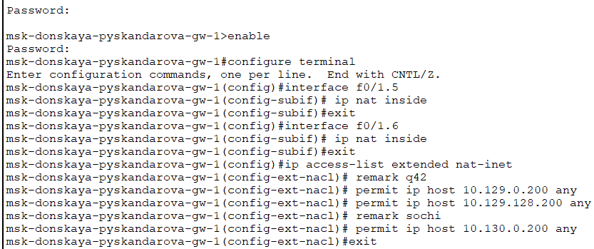

---
## Front matter
lang: ru-RU
title: Лабораторная работа 14
subtitle: Администрирование локальных сетей
author:
  - Скандарова П.Ю.
institute:
  - Российский университет дружбы народов, Москва, Россия
date: 17 мая 2025

## i18n babel
babel-lang: russian
babel-otherlangs: english

## Formatting pdf
toc: false
toc-title: Содержание
slide_level: 2
aspectratio: 169
section-titles: true
theme: metropolis
header-includes:
 - \metroset{progressbar=frametitle,sectionpage=progressbar,numbering=fraction}
---

# Информация

## Докладчик

:::::::::::::: {.columns align=center}
::: {.column width="70%"}

  * Скандарова Полина Юррьевна
  * Российский университет дружбы народов
  * [1132221815@pfur.ru](mailto:1132221815@pfur.ru)
  * <https://pyskandarova.github.io/ru/>

:::
::: {.column width="30%"}

:::
::::::::::::::

# Вводная часть

## Цели и задачи

Настроить взаимодействие через сеть провайдера посредством статической маршрутизации локальной сети организации с сетью основного здания, расположенного в 42-м квартале в Москве, и сетью филиала, расположенного в г. Сочи.

## Задание

1. Настроить связь между территориями (1-5).
2. Настроить оборудование, расположенное в квартале 42 в Москве (6-9).
3. Настроить оборудование, расположенное в филиале в г. Сочи (10-11).
4. Настроить статическую маршрутизацию между территориями (12-14).
5. Настроить статическую маршрутизацию на территории квартала 42 в г. Москве (15-16).
6. Настроить NAT на маршрутизаторе msk-donskaya-gw-1 (17).

# Выполнение лабораторной работы

## Настройка линка между площадками 1

:::::::::::::: {.columns align=center}
::: {.column width="30%"}

Настройка интерфейсов коммутатора provider-sw-1

:::
::: {.column width="70%"}

:::
::::::::::::::

## Настройка линка между площадками 2

:::::::::::::: {.columns align=center}
::: {.column width="30%"}

Настройка интерфейсов маршрутизатора msk-donskaya-gw-1

:::
::: {.column width="70%"}

:::
::::::::::::::

## Настройка линка между площадками 3

:::::::::::::: {.columns align=center}
::: {.column width="30%"}

Настройка интерфейсов маршрутизатора msk-q42-gw-1

:::
::: {.column width="70%"}

:::
::::::::::::::

## Настройка линка между площадками 4

:::::::::::::: {.columns align=center}
::: {.column width="30%"}

Настройка интерфейсов коммутатора sch-sochi-sw-1

:::
::: {.column width="70%"}

:::
::::::::::::::

## Настройка линка между площадками 5

:::::::::::::: {.columns align=center}
::: {.column width="30%"}

Настройка интерфейсов маршрутизатора sch-sochi-gw-1

:::
::: {.column width="70%"}

:::
::::::::::::::

## Настройка площадки 42-го квартала 6

:::::::::::::: {.columns align=center}
::: {.column width="30%"}

Настройка интерфейсов маршрутизатора msk-q42-gw-1

:::
::: {.column width="70%"}

:::
::::::::::::::

## Настройка площадки 42-го квартала 7

:::::::::::::: {.columns align=center}
::: {.column width="30%"}

Настройка интерфейсов коммутатора msk-q42-sw-1

:::
::: {.column width="70%"}

:::
::::::::::::::

## Настройка площадки 42-го квартала 8

:::::::::::::: {.columns align=center}
::: {.column width="30%"}

Настройка интерфейсов маршрутизирующего коммутатора msk-hostel-gw-1

:::
::: {.column width="70%"}

:::
::::::::::::::

## Настройка площадки 42-го квартала 9

:::::::::::::: {.columns align=center}
::: {.column width="30%"}

Настройка интерфейсов коммутатора msk-hostel-sw-1

:::
::: {.column width="70%"}

:::
::::::::::::::

## Настройка площадки в Сочи 10

:::::::::::::: {.columns align=center}
::: {.column width="30%"}

Настройка интерфейсов маршрутизатора sch-sochi-gw-1

:::
::: {.column width="70%"}

:::
::::::::::::::

## Настройка площадки в Сочи 11

:::::::::::::: {.columns align=center}
::: {.column width="30%"}

Настройка интерфейсов коммутатора sch-sochi-sw-1

:::
::: {.column width="70%"}

:::
::::::::::::::

## Настройка маршрутизации между площадками 12

:::::::::::::: {.columns align=center}
::: {.column width="30%"}

Настройка маршрутизатора msk-donskaya-gw-1

:::
::: {.column width="70%"}

:::
::::::::::::::

## Настройка маршрутизации между площадками 13

:::::::::::::: {.columns align=center}
::: {.column width="30%"}

Настройка маршрутизатора msk-q42-gw-1

:::
::: {.column width="70%"}

:::
::::::::::::::

## Настройка маршрутизации между площадками 14

:::::::::::::: {.columns align=center}
::: {.column width="30%"}

Настройка маршрутизатора sch-sochi-gw-1

:::
::: {.column width="70%"}

:::
::::::::::::::

##  Настройка маршрутизации на 42 квартале 15

:::::::::::::: {.columns align=center}
::: {.column width="30%"}

Настройка маршрутизатора msk-q42-gw-1

:::
::: {.column width="70%"}

:::
::::::::::::::

##  Настройка маршрутизации на 42 квартале 16

:::::::::::::: {.columns align=center}
::: {.column width="30%"}

Настройка интерфейсов маршрутизирующего коммутатора msk-hostel-gw-1

:::
::: {.column width="70%"}

:::
::::::::::::::

## Настройка NAT на маршрутизаторе msk-donskaya-gw-1 17

:::::::::::::: {.columns align=center}
::: {.column width="30%"}

Настройка NAT на маршрутизаторе msk-donskaya-gw-1

:::
::: {.column width="70%"}

:::
::::::::::::::

# Результаты

Настроено взаимодействие через сеть провайдера посредством статической маршрутизации локальной сети организации с сетью основного здания, расположенного в 42-м квартале в Москве, и сетью филиала, расположенного в г. Сочи.
