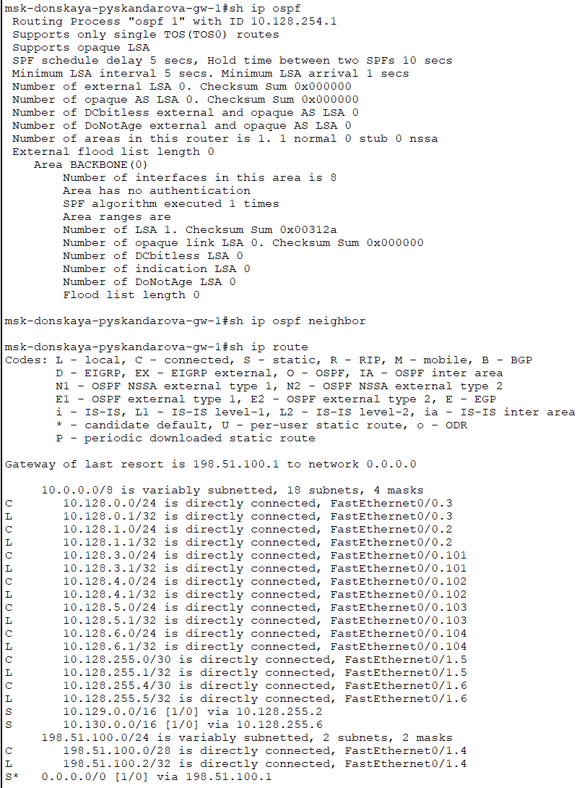
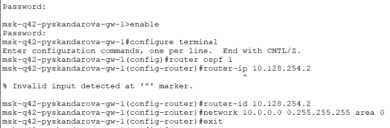
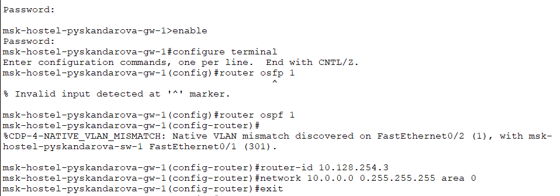
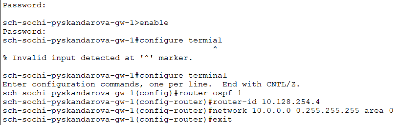
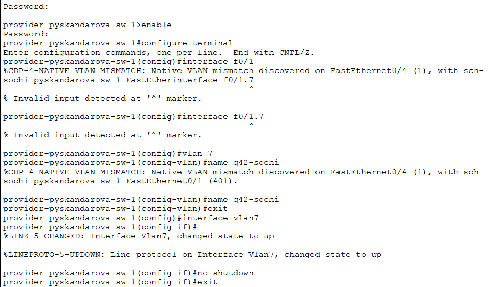
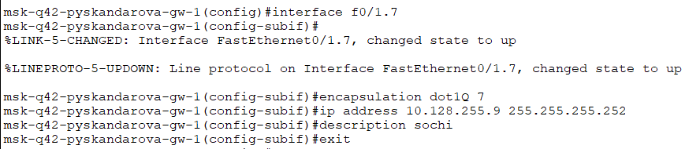
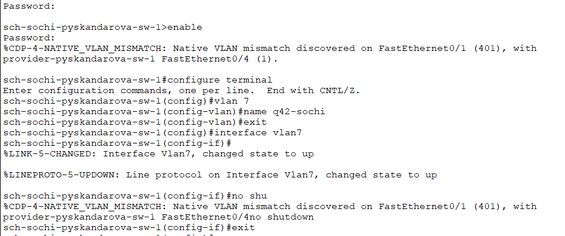
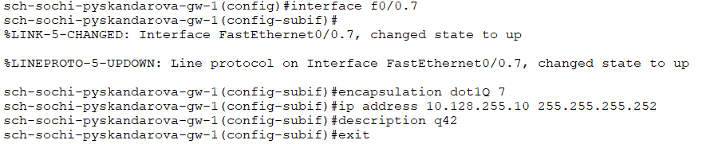
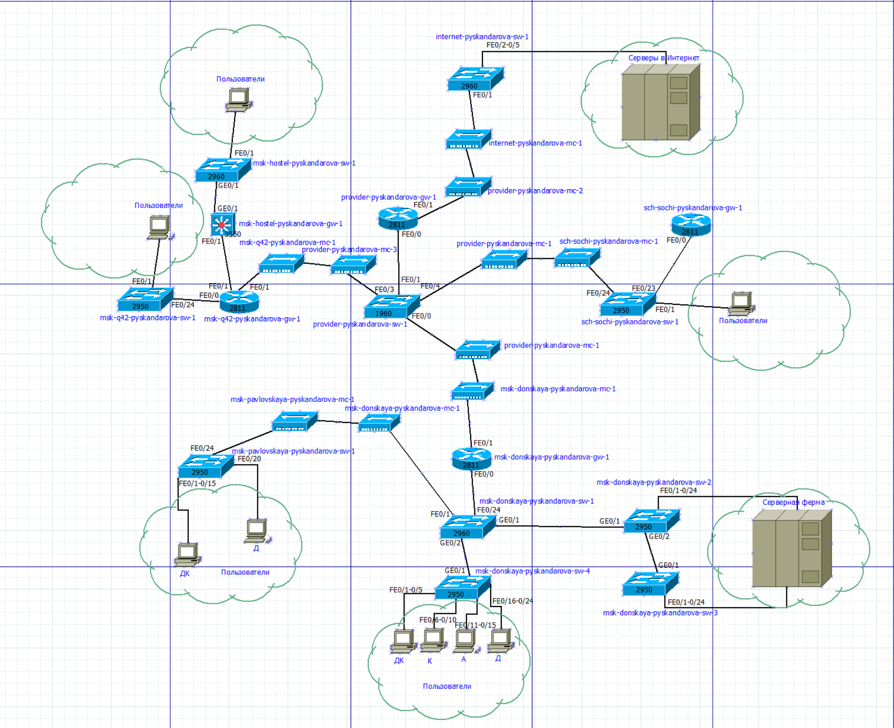
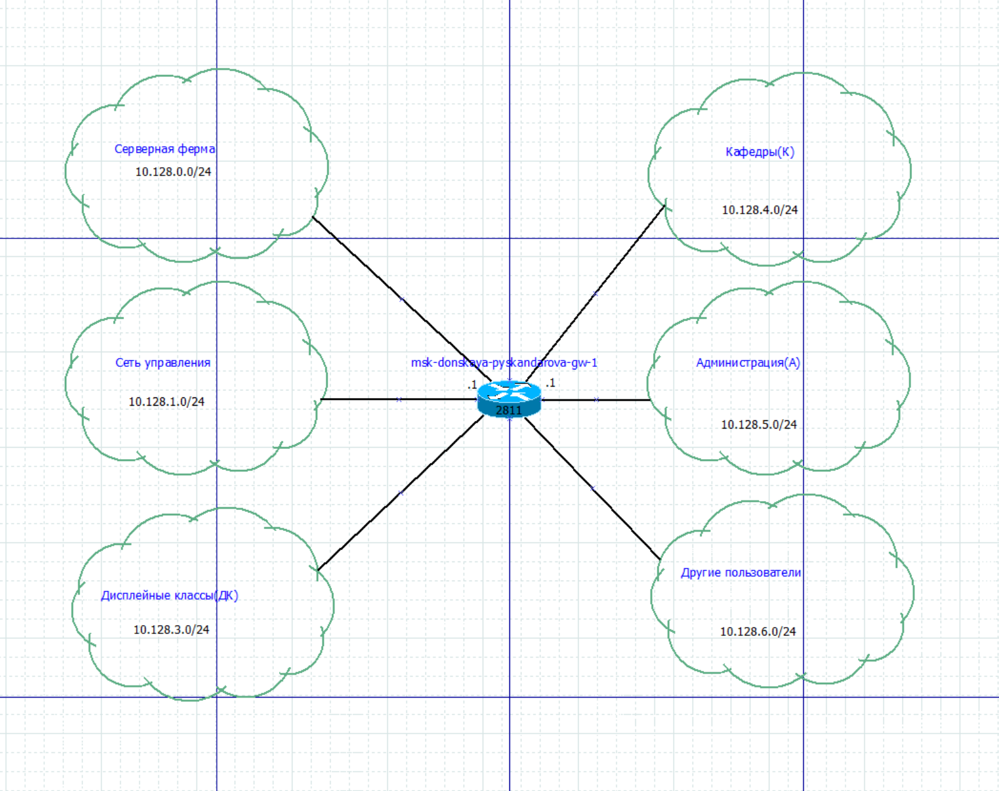

---
## Front matter
lang: ru-RU
title: Лабораторная работа №15
subtitle: Администрирование локальных сетей
author:
  - Скандарова П. Ю.
institute:
  - Российский университет дружбы народов, Москва, Россия
date: 22 мая 2025

## i18n babel
babel-lang: russian
babel-otherlangs: english

## Formatting pdf
toc: false
toc-title: Содержание
slide_level: 2
aspectratio: 169
section-titles: true
theme: metropolis
header-includes:
 - \metroset{progressbar=frametitle,sectionpage=progressbar,numbering=fraction}
---

# Информация

## Докладчик

  * Скандарова Полина Юрьевна
  * Российский университет дружбы народов
  * [1132221815@pfur.ru](mailto:1132221815@pfur.ru)
  * <https://pysakandarova.github.io/ru/>

# Вводная часть

## Цели и задачи

Настроить динамическую маршрутизацию между территориями организации.

# Задание

## 0

1. Настроить динамическую маршрутизацию по протоколу OSPF на маршрутизаторах msk-donskaya-gw-1, msk-q42-gw-1, msk-hostel-gw-1, sch-sochi-gw-1.
2. Настроить связь сети квартала 42 в Москве с сетью филиала в г. Сочи напрямую.
3. В режиме симуляции отследить движение пакета ICMP с ноутбука администратора сети на Донской в Москве (Laptop-PT admin) до компьютера пользователя в филиале в г. Сочи pc-sochi-1.
4. На коммутаторе провайдера отключить временно vlan 6 и в режиме симуляции убедиться в изменении маршрута прохождения пакета ICMP с ноутбука администратора сети на Донской в Москве (Laptop-PT admin) до компьютера пользователя в филиале в г. Сочи pc-sochi-1.
5. На коммутаторе провайдера восстановить vlan 6 и в режиме симуляции убедиться в изменении маршрута прохождения пакета ICMP с ноутбука администратора сети на Донской в Москве (Laptop-PT admin) до компьютера пользователя в филиале в г. Сочи pc-sochi-1.

## 1

:::::::::::::: {.columns align=center}
::: {.column width="70%"}

Включение OSPF на маршрутизаторе предполагает, во-первых, включение процесса OSPF командой router ospf <process-id>, во-вторых — назначение областей (зон) интерфейсам с помощью команды network <network or IP address> <mask> area <area-id>. Идентификатор процесса OSPF (process-id) по сути идентифицирует маршрутизатор в автономной системе, и, вообще говоря, он не должен совпадать с идентификаторами процессов на других маршрутизаторах. Значение идентификатора области (area-id) может быть целым числом от 0 до 4294967295 или может быть представлено в виде IP-адреса: A.B.C.D. Область 0 называется магистралью, области с другими идентификаторами должны подключаться к магистрали.

Настройка маршрутизатора msk-donskaya-gw-1

:::
::: {.column width="30%"}

:::
::::::::::::::

## 2

:::::::::::::: {.columns align=center}
::: {.column width="30%"}

Маршрутизаторы с общим сегментом являются соседями в этом сегменте. Соседи выбираются с помощью протокола Hello. Команда show ip ospf neighbor показывает статус всех соседей в заданном сегменте. Команда show ip ospf route (или show ip route) выводит информацию из таблицы маршрутизации.

Проверка состояния протокола OSPF на маршрутизаторе msk-donskaya-gw-1

:::
::: {.column width="70%"}

:::
::::::::::::::

## 3

:::::::::::::: {.columns align=center}
::: {.column width="30%"}

Настройка маршрутизатора msk-q42-gw-1

:::
::: {.column width="70%"}

:::
::::::::::::::

## 4

:::::::::::::: {.columns align=center}
::: {.column width="30%"}

Настройка маршрутизирующего коммутатора msk-hostel-gw-1

:::
::: {.column width="70%"}

:::
::::::::::::::

## 5

:::::::::::::: {.columns align=center}
::: {.column width="30%"}

Настройка маршрутизатора sch-sochi-gw-1

:::
::: {.column width="70%"}

:::
::::::::::::::

## 6

:::::::::::::: {.columns align=center}
::: {.column width="30%"}

Настройка интерфейсов коммутатора provider-sw-1

:::
::: {.column width="70%"}

:::
::::::::::::::

## 7

:::::::::::::: {.columns align=center}
::: {.column width="30%"}

Настройка маршрутизатора msk-q42-gw-1

:::
::: {.column width="70%"}

:::
::::::::::::::

## 8

:::::::::::::: {.columns align=center}
::: {.column width="30%"}

Настройка коммутатора sch-sochi-sw-1

:::
::: {.column width="70%"}

:::
::::::::::::::

## 9

:::::::::::::: {.columns align=center}
::: {.column width="30%"}

Настройка маршрутизатора sch-sochi-gw-1

:::
::: {.column width="70%"}

:::
::::::::::::::

## 10

:::::::::::::: {.columns align=center}
::: {.column width="30%"}

Схема L1

:::
::: {.column width="70%"}

:::
::::::::::::::

## 11

:::::::::::::: {.columns align=center}
::: {.column width="30%"}

Схема L3

:::
::: {.column width="70%"}

:::
::::::::::::::

# Результаты

## Выводы

Настроена динамическая маршрутизация между территориями организации.