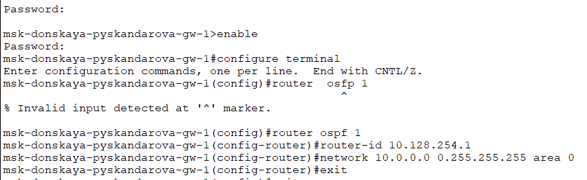
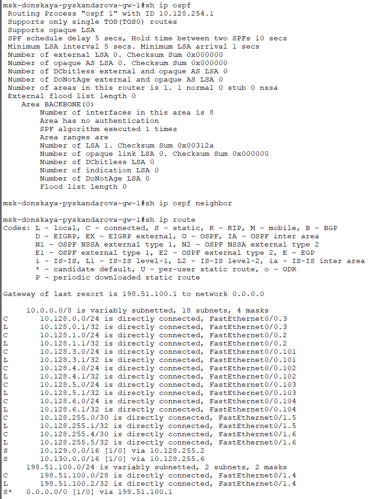
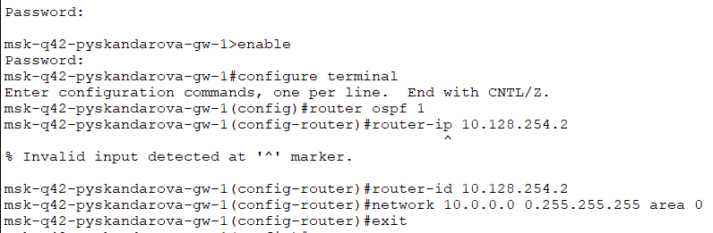
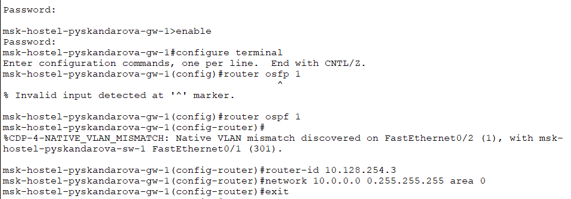
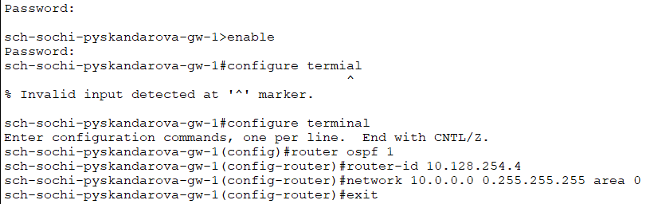
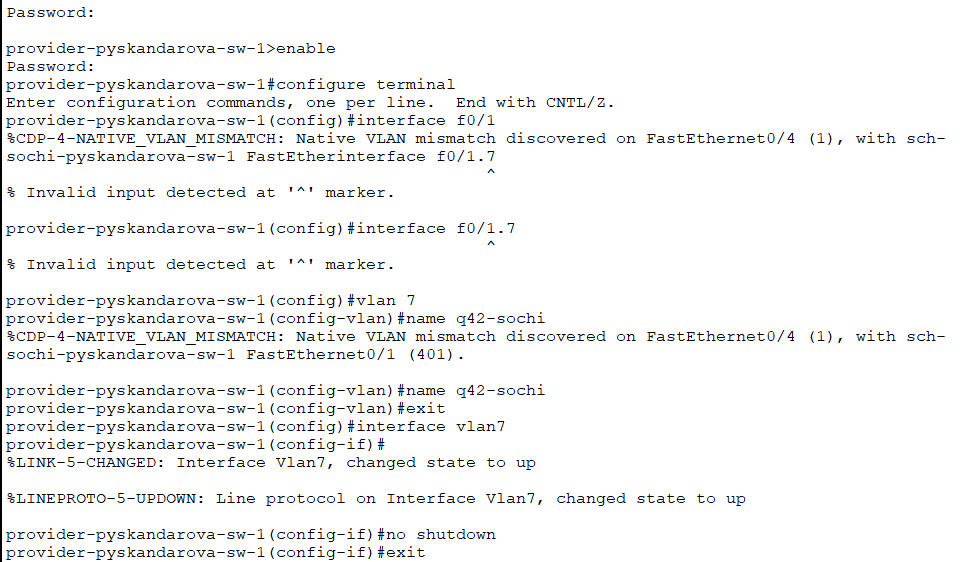
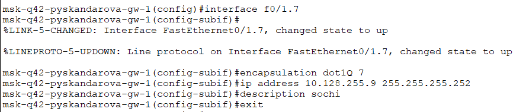
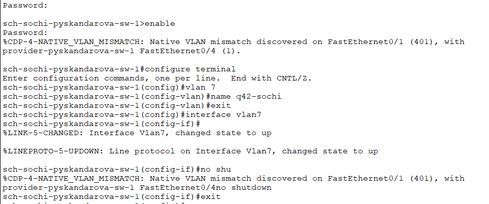
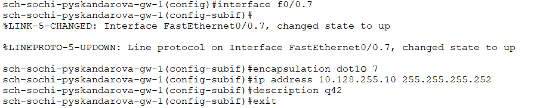

---
## Front matter
title: "Лабораторная работа №15"
subtitle: "Администрирование локальных сетей"
author: "Скандарова Полина Юрьевна"

## Generic otions
lang: ru-RU
toc-title: "Содержание"

## Bibliography
bibliography: bib/cite.bib
csl: pandoc/csl/gost-r-7-0-5-2008-numeric.csl

## Pdf output format
toc: true # Table of contents
toc-depth: 2
lof: true # List of figures
lot: true # List of tables
fontsize: 12pt
linestretch: 1.5
papersize: a4
documentclass: scrreprt
## I18n polyglossia
polyglossia-lang:
  name: russian
  options:
	- spelling=modern
	- babelshorthands=true
polyglossia-otherlangs:
  name: english
## I18n babel
babel-lang: russian
babel-otherlangs: english
## Fonts
mainfont: IBM Plex Serif
romanfont: IBM Plex Serif
sansfont: IBM Plex Sans
monofont: IBM Plex Mono
mathfont: STIX Two Math
mainfontoptions: Ligatures=Common,Ligatures=TeX,Scale=0.94
romanfontoptions: Ligatures=Common,Ligatures=TeX,Scale=0.94
sansfontoptions: Ligatures=Common,Ligatures=TeX,Scale=MatchLowercase,Scale=0.94
monofontoptions: Scale=MatchLowercase,Scale=0.94,FakeStretch=0.9
mathfontoptions:
## Biblatex
biblatex: true
biblio-style: "gost-numeric"
biblatexoptions:
  - parentracker=true
  - backend=biber
  - hyperref=auto
  - language=auto
  - autolang=other*
  - citestyle=gost-numeric
## Pandoc-crossref LaTeX customization
figureTitle: "Рис."
tableTitle: "Таблица"
listingTitle: "Листинг"
lofTitle: "Список иллюстраций"
lotTitle: "Список таблиц"
lolTitle: "Листинги"
## Misc options
indent: true
header-includes:
  - \usepackage{indentfirst}
  - \usepackage{float} # keep figures where there are in the text
  - \floatplacement{figure}{H} # keep figures where there are in the text
---

# Цель работы

Настроить динамическую маршрутизацию между территориями организации.

# Задание

1. Настроить динамическую маршрутизацию по протоколу OSPF на маршрутизаторах msk-donskaya-gw-1, msk-q42-gw-1, msk-hostel-gw-1, sch-sochi-gw-1 (рис. [-@fig:001] , [-@fig:002] , [-@fig:003] , [-@fig:004] , [-@fig:005] ).
2. Настроить связь сети квартала 42 в Москве с сетью филиала в г. Сочи напрямую (рис. [-@fig:006] , [-@fig:007] , [-@fig:008] , [-@fig:009] ).
3. В режиме симуляции отследить движение пакета ICMP с ноутбука администратора сети на Донской в Москве (Laptop-PT admin) до компьютера пользователя в филиале в г. Сочи pc-sochi-1.
4. На коммутаторе провайдера отключить временно vlan 6 и в режиме симуляции убедиться в изменении маршрута прохождения пакета ICMP с ноутбука администратора сети на Донской в Москве (Laptop-PT admin) до компьютера пользователя в филиале в г. Сочи pc-sochi-1.
5. На коммутаторе провайдера восстановить vlan 6 и в режиме симуляции убедиться в изменении маршрута прохождения пакета ICMP с ноутбука администратора сети на Донской в Москве (Laptop-PT admin) до компьютера пользователя в филиале в г. Сочи pc-sochi-1.

# Выполнение лабораторной работы

Включение OSPF на маршрутизаторе предполагает, во-первых, включение процесса OSPF командой router ospf <process-id>, во-вторых — назначение областей (зон) интерфейсам с помощью команды network <network or IP address> <mask> area <area-id>.

{#fig:001 width=70%}

Идентификатор процесса OSPF (process-id) по сути идентифицирует маршрутизатор в автономной системе, и, вообще говоря, он не должен совпадать
с идентификаторами процессов на других маршрутизаторах.
Значение идентификатора области (area-id) может быть целым числом от 0 до 4294967295 или может быть представлено в виде IP-адреса: A.B.C.D. Область 0 называется магистралью, области с другими идентификаторами должны подключаться к магистрали.

{#fig:002 width=70%}

Маршрутизаторы с общим сегментом являются соседями в этом сегменте. Соседи выбираются с помощью протокола Hello. Команда show ip ospf neighbor показывает статус всех соседей в заданном сегменте. Команда show ip ospf route (или show ip route) выводит информацию из таблицы маршрутизации.

{#fig:003 width=70%}

{#fig:004 width=70%}

{#fig:005 width=70%}

{#fig:006 width=70%}

{#fig:007 width=70%}

{#fig:008 width=70%}

{#fig:009 width=70%}

# Выводы

Настроена динамическая маршрутизация между территориями организации.
