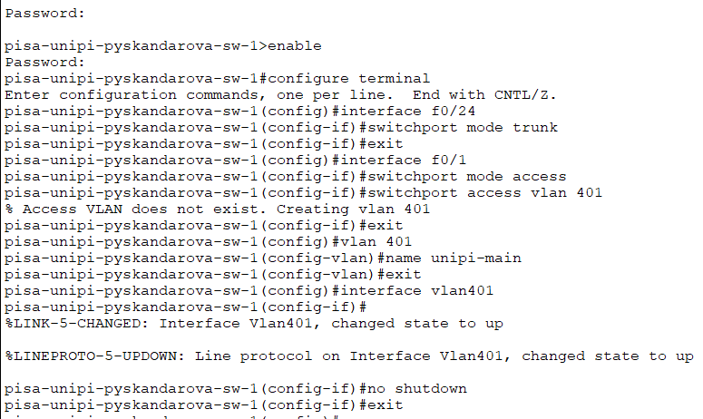

---
## Front matter
lang: ru-RU
title: Презентация по лабораторной работе 16
subtitle: Администрирование локальных сетей
author:
  - Скандарова П.Ю.
institute:
  - Российский университет дружбы народов, Москва, Россия
date: 31 мая 2025

## i18n babel
babel-lang: russian
babel-otherlangs: english

## Formatting pdf
toc: false
toc-title: Содержание
slide_level: 2
aspectratio: 169
section-titles: true
theme: metropolis
header-includes:
 - \metroset{progressbar=frametitle,sectionpage=progressbar,numbering=fraction}
---

# Информация

## Докладчик

  * Сандарова Полина Юрьевна
  * Российский университет дружбы народов
  * [1132221815@pfur.ru](mailto:1132221815@pfur.ru)
  * <https://pyskandarova.github.io/ru/>

# Вводная часть

## Цели и задачи

Получение навыков настройки VPN-туннеля через незащищённое Интернет-соединение.

# Выполнение лабораторной работы

## 1

:::::::::::::: {.columns align=center}
::: {.column width="30%"}

Разместить в рабочей области проекта в соответствии с модельными предположениями оборудование для сети Университета г. Пиза.

:::
::: {.column width="70%"}

:::
::::::::::::::

## 2

:::::::::::::: {.columns align=center}
::: {.column width="30%"}

В физической рабочей области проекта создать город Пиза, здание Университета г. Пиза. Переместить туда соответствующее оборудование.

:::
::: {.column width="70%"}

:::
::::::::::::::

## 3

:::::::::::::: {.columns align=center}
::: {.column width="30%"}

Сделать первоначальную настройку и настройку интерфейсов оборудования сети Университета г. Пиза.
Первоначальная настройка маршрутизатора pisa-unipi-gw-1.

:::
::: {.column width="70%"}

:::
::::::::::::::

## 4

:::::::::::::: {.columns align=center}
::: {.column width="30%"}

Первоначальная настройка коммутатора pisa-unipi-sw-1.

:::
::: {.column width="70%"}

:::
::::::::::::::

## 5

:::::::::::::: {.columns align=center}
::: {.column width="30%"}

Настройка интерфейсов маршрутизатора pisa-unipi-gw-1.

:::
::: {.column width="70%"}

:::
::::::::::::::

## 6

:::::::::::::: {.columns align=center}
::: {.column width="30%"}

Настройка интерфейсов коммутатора pisa-unipi-sw-1

:::
::: {.column width="70%"}

:::
::::::::::::::

## 7

:::::::::::::: {.columns align=center}
::: {.column width="30%"}

Настроить VPN на основе протокола GRE [25]. Настройка маршрутизатора msk-donskaya-gw-1.

:::
::: {.column width="70%"}

:::
::::::::::::::

## 8

:::::::::::::: {.columns align=center}
::: {.column width="30%"}

Настройка маршрутизатора pisa-unipi-gw-1.

:::
::: {.column width="70%"}

:::
::::::::::::::

# Результаты

## Вывод

Получены навыки настройки VPN-туннеля через незащищённое Интернет-соединение.
