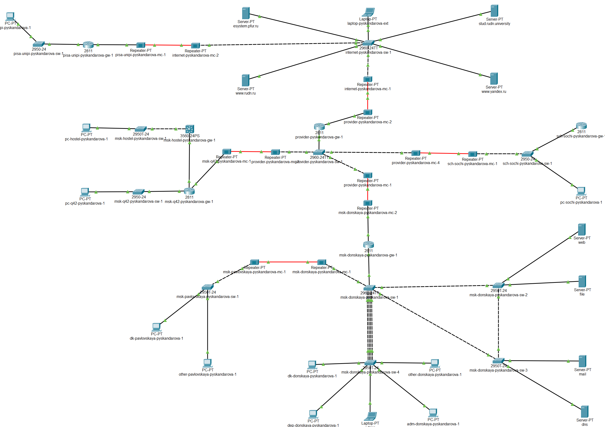
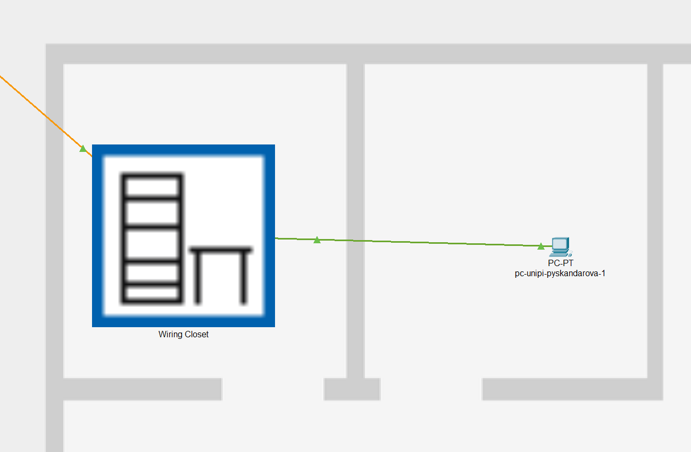
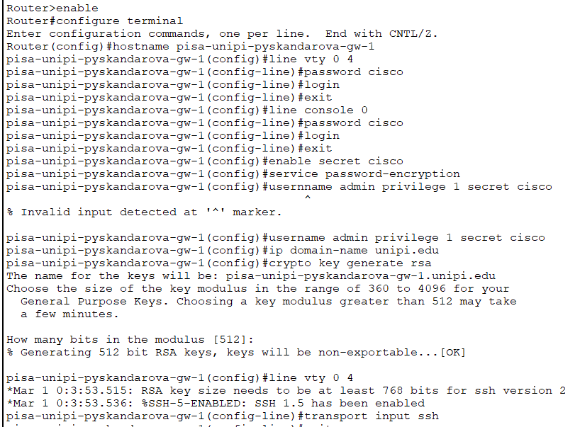
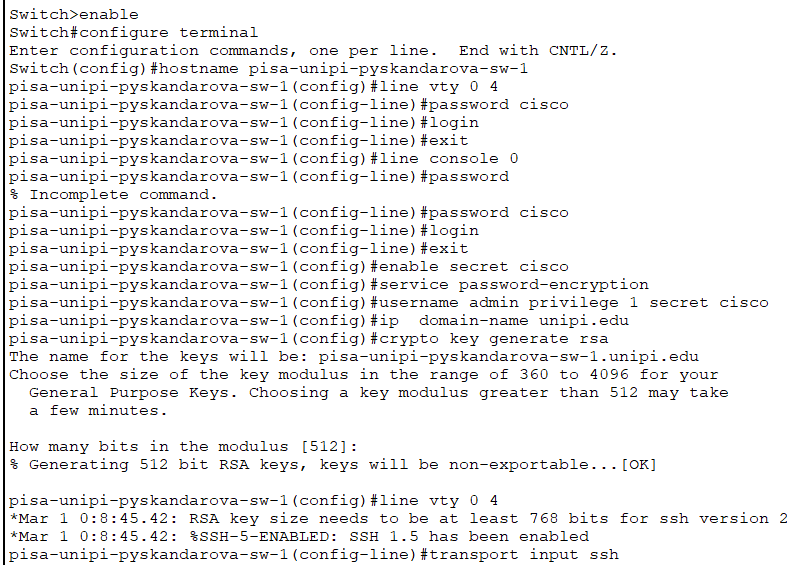
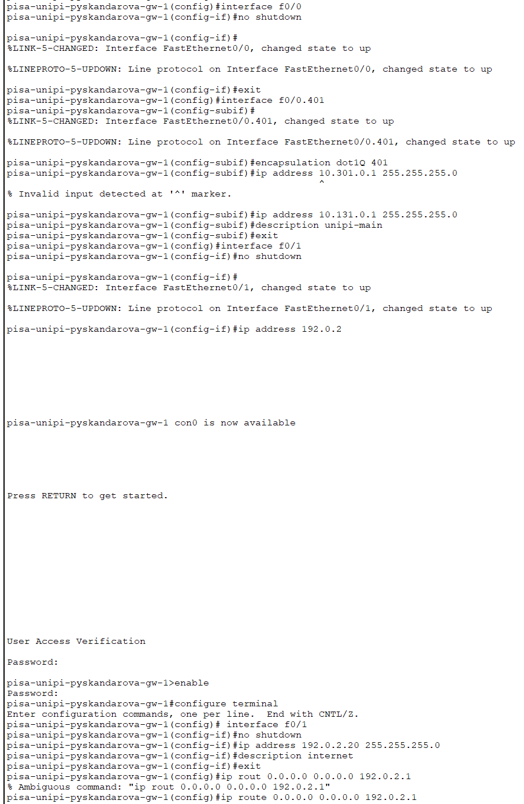
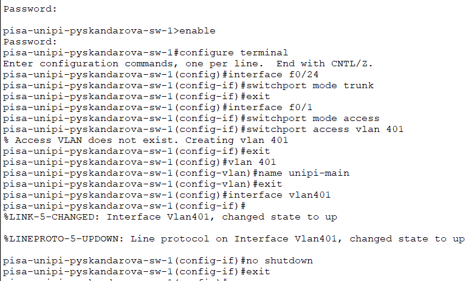
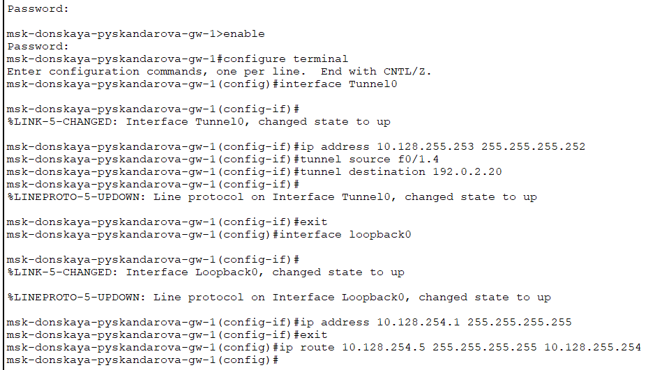
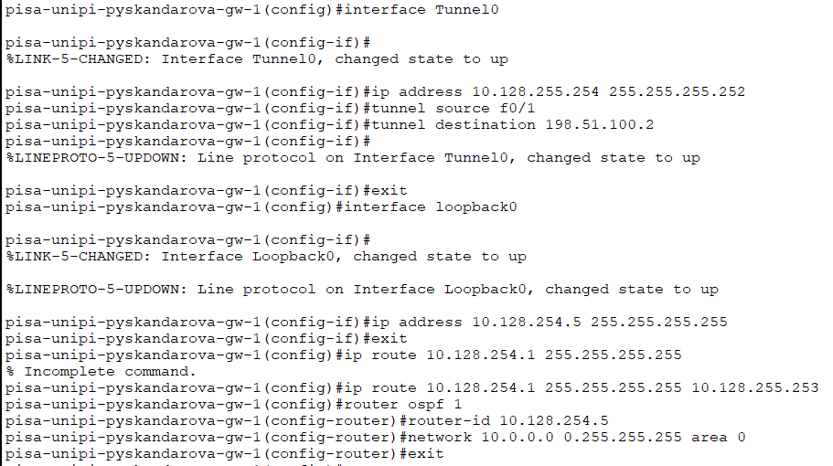

---
## Front matter
title: "Отчёт по лабораторной работе 16"
subtitle: "Администрирование локальных сетей"
author: "Скандарова Полина Юрьевна"

## Generic otions
lang: ru-RU
toc-title: "Содержание"

## Bibliography
bibliography: bib/cite.bib
csl: pandoc/csl/gost-r-7-0-5-2008-numeric.csl

## Pdf output format
toc: true # Table of contents
toc-depth: 2
lof: true # List of figures
lot: true # List of tables
fontsize: 12pt
linestretch: 1.5
papersize: a4
documentclass: scrreprt
## I18n polyglossia
polyglossia-lang:
  name: russian
  options:
	- spelling=modern
	- babelshorthands=true
polyglossia-otherlangs:
  name: english
## I18n babel
babel-lang: russian
babel-otherlangs: english
## Fonts
mainfont: IBM Plex Serif
romanfont: IBM Plex Serif
sansfont: IBM Plex Sans
monofont: IBM Plex Mono
mathfont: STIX Two Math
mainfontoptions: Ligatures=Common,Ligatures=TeX,Scale=0.94
romanfontoptions: Ligatures=Common,Ligatures=TeX,Scale=0.94
sansfontoptions: Ligatures=Common,Ligatures=TeX,Scale=MatchLowercase,Scale=0.94
monofontoptions: Scale=MatchLowercase,Scale=0.94,FakeStretch=0.9
mathfontoptions:
## Biblatex
biblatex: true
biblio-style: "gost-numeric"
biblatexoptions:
  - parentracker=true
  - backend=biber
  - hyperref=auto
  - language=auto
  - autolang=other*
  - citestyle=gost-numeric
## Pandoc-crossref LaTeX customization
figureTitle: "Рис."
tableTitle: "Таблица"
listingTitle: "Листинг"
lofTitle: "Список иллюстраций"
lotTitle: "Список таблиц"
lolTitle: "Листинги"
## Misc options
indent: true
header-includes:
  - \usepackage{indentfirst}
  - \usepackage{float} # keep figures where there are in the text
  - \floatplacement{figure}{H} # keep figures where there are in the text
---

# Цель работы

Получение навыков настройки VPN-туннеля через незащищённое Интернет-соединение.

# Выполнение лабораторной работы

1. Разместить в рабочей области проекта в соответствии с модельными предположениями оборудование для сети Университета г. Пиза.(рис. [-@fig:001])

{#fig:001 width=70%}

2. В физической рабочей области проекта создать город Пиза, здание Университета г. Пиза. Переместить туда соответствующее оборудование. (рис. [-@fig:002])

{#fig:002 width=70%}

3. Сделать первоначальную настройку и настройку интерфейсов оборудования сети Университета г. Пиза. (рис. [-@fig:003] , рис. [-@fig:004] , рис. [-@fig:005] , рис. [-@fig:006])

{#fig:003 width=70%}

{#fig:004 width=70%}

{#fig:005 width=70%}

{#fig:006 width=70%}

4. Настроить VPN на основе протокола GRE [25]. (рис. [-@fig:007] , рис. [-@fig:008])

{#fig:007 width=70%}

{#fig:008 width=70%}

5. Проверить доступность узлов сети Университета г. Пиза с ноутбука администратора сети «Донская». Проверка будет проведена отдельно.

# Выводы

Получены навыки настройки VPN-туннеля через незащищённое Интернет-соединение.